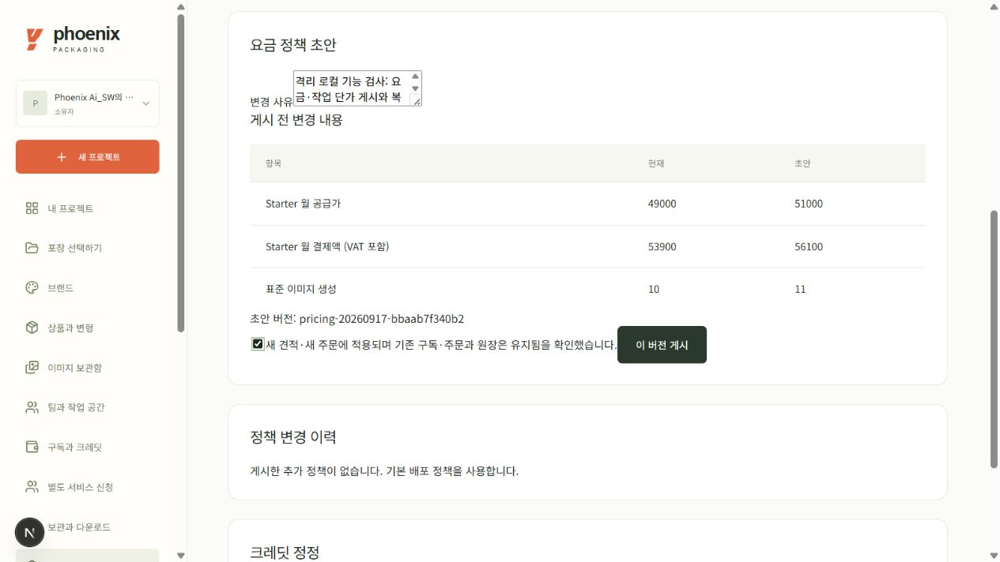
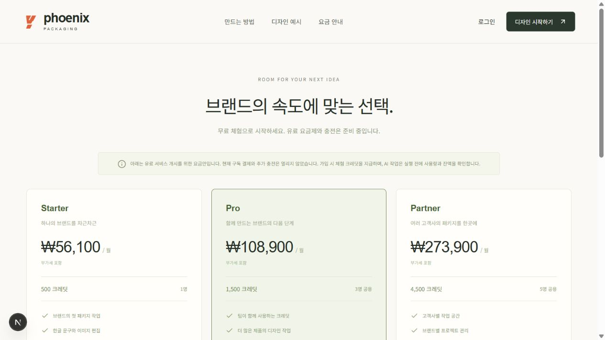

# 요금·모델 정책과 크레딧 정정

2026-09-18 로컬 개발 후보. 운영 배포 전이며 실제 운영의 가격/크레딧을 변경하지 않았다.

관리자 → 요금·모델 정책에서 현재 정책으로 초안을 만든다. 공급가/부가세 포함액, 월 크레딧, 충전 금액, 작업 단가를 수정하고 사유를 저장한다. 서버 검증 후 변경 비교를 확인하고 게시한다. 게시 포인터는 동시 게시 시 충돌을 반환한다. 버전 내용/해시는 변경하지 않으며 예전 정책으로 복원할 때도 새 버전을 만든다.

새 작업 견적/새 주문에는 현재 정책을 적용한다. 이미 만든 주문은 금액·크레딧·정책 스냅샷을 유지한다. 기존 유효 구독의 갱신과 요금제 변경은 처음 동의한 요금표를 사용하고, 미사용 업그레이드 환불 시 이전 스냅샷으로 복구한다. DB0015는 기존 구독/주문에 당시 요금표를 복사한다. 공개 요금 화면도 서버 정책을 조회한다. 이 화면으로 실제 결제나 제조 승인 게이트를 열 수 없다.

모델/품질은 서버 배포 허용 범위 안에서 설정한다. API 견적, 작업 예약, 제공자 호출 직전과 자산 게시 전에 다시 확인한다. 대기 중 철회는 호출 없이 예약 반환, 호출 도중 철회는 제공자 비용은 남기고 고객 크레딧은 반환한다. 일 예산/월 경고는 서버 한도보다 높일 수 없고 미확인 요청당 확보액은 낮출 수 없다. 실제 청구서의 절대 상한을 보장하는 기능은 아니다.

크레딧 정정은 대상 작업 공간 조회 후 수량·사용 범위·유효기간·사유를 확인하여 별도 원장 기록으로 추가한다. 회수는 특정 지급분의 유효 미사용 잔액까지만 가능하다. 예약·소비·만료 이력은 덮어쓰지 않고 이전 원장도 수정하지 않는다. 중복 키는 한 번만 반영하며, 새 지급이 구독이나 유료 고객 자격을 만들지 않는다.

## 검증

- 정책/권한/CSRF/엄격 정수/예산 한도/단가 변경/모델 철회/응답 후 철회/중복·동시 정정: 8개 통과.
- 기존 주문·충전·구독 갱신·요금 변경·환불 조건 보존: 5개 통과.
- 이전 DB에 요금 스냅샷 추가·복귀와 PostgreSQL RLS SQL: 1개 통과.
- 기존 AI 회귀와 가격 회귀 합계35개 통과. 모두 fixture/모의 제공자, 실제 유료 호출 없음.
- 첫 게시 행 잠금, 전역 관리자 팀 역할/CSRF, 오래된 정책 객체 재게시의 독립 회귀 5개 통과. SQLite의 두 세션 인터리빙과 PostgreSQL SQL 검토를 구분한다. 운영 PostgreSQL 경쟁 시험은 하지 않았다.

## 실제 화면에서 수행한 로컬 검증

2026-09-18 격리된 localhost:3001에서 관리자 화면으로 다음을 수행했다. 운영 요금표와 운영 크레딧에는 적용하지 않았다.

1. Starter 공급가 49,000원→51,000원, 표준 작업 10→11크레딧을 사유와 함께 초안 저장했다. 비교 화면에서 부가세 포함 53,900원→56,100원을 확인하고 게시했다.
2. 공개 요금 화면에서 월 56,100원과 표준 11크레딧 표시를 확인했다. 이어 원래 49,000원/10크레딧으로 새 버전을 발행하여 복원했다. 기존 게시 버전은 남는다.
3. 로컬 QA 작업 공간에 표준 전용 3크레딧을 지급하고, 해당 지급분을 지정해 3크레딧을 회수했다. 잔액은 30으로 돌아왔고 예약 0·기소비 40은 바뀌지 않았다. 두 사유와 정정 원장 기록이 각각 남았다.

위 검증에는 실제 결제, 유료 AI 호출, 유료 자격 부여가 없다. 전체 최종 회귀와 운영 배포 결과는 릴리스 기록에 따로 남긴다.
