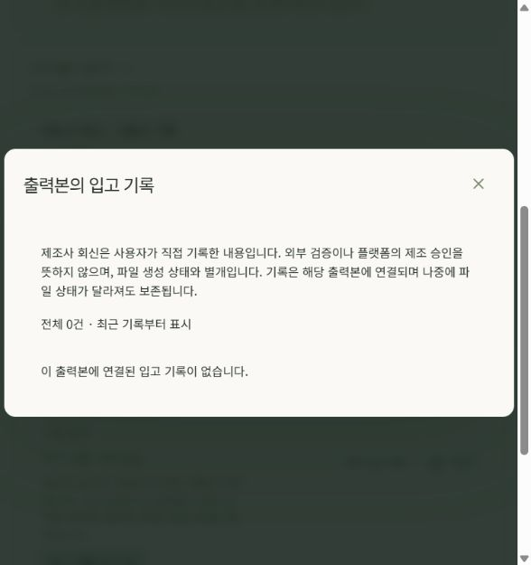

# 서비스 수납·가공·출력 이력 보완

2026-09-18. 최초 작업지시서와 재감사에서 확인한 내부 누락을 보완하는 후속 작업이다. PR11 기능 코드의 운영 배포와 실제 수행 증거를 기록한다. 과거 PR9 검증, 로컬 모의 시험, 이번 운영 확인을 구분한다.

| 원문/요청 | 이번 변경 | 실제 확인과 한계 |
| --- | --- | --- |
| §12.1·16 별도 주문 | 수락 견적을 일회 수납 또는 첫 달 Pro에 연결. 견적·조건·명시 동의 고정 | localhost3001에서 55,000원 일회 모의 수납→업무 진행, 크레딧0·자동 갱신0. Pro는 추가 동의 전 결제 차단→99,000원 모의 승인→1,500크레딧/3좌석→갱신 중단→미사용 전액 모의 환불. 외부 PG 호출0 |
| 구멍·개봉부·지퍼·노치 출력 | CUT의 실제 원형·U/V 노치, 아트에서 해당 절개부 제거, 별도 PROCESS PDF·가공 JSON, 승인 도면의 물리 치수와 해시 연결 | 실제 메뉴에서160×230mm, 구멍80/15/Ø6mm, 개봉부30mm, 지퍼35±3mm, U노치Y24/3×4mm 저장. 합성 ICC 시험 ZIP8파일/8PDF페이지 검수. 실제 제조 승인 아님 |
| §13.1 완료 출력 소실 | 다운로드 전 해시 확인·정기 확인, 확정 손실의 무료 재시도 또는 유료 차감 보상 | 불명확 응답과 확정 손실 분리, 5분 이상 간격의 동일 관측2회. 의도된 삭제 제외. 보상 후 기존 무료 제작 권한 재검사. 운영 파일을 손상시키지 않음 |
| §5·11.3 제조 입고 상태 | 파일 생성 결과와 별개인 현재 입고 상태·페이지별 기록, 제조사 자가회신/내부시험/미분류 구분 | 기존 불변 출력 결과를 덮어쓰지 않음. 기술 반려 이력 보존. 실제 제조사 회신·10건 제출 성과를 만들어내지 않음 |
| 검수 항목→수정 요소 | 가공부 충돌의 `faces.back.objects.0`을 검수한 Scene의 실제 면/객체 ID에 연결 | 레이어 순서가 바뀌어도 ID로 선택하고 삭제된 객체는 면으로 이동. 실측 충돌 회귀와 UI 대상 검사 |

## 실제 메뉴 수행 기록

격리 QA는 개발용 SQLite와 복사된 저장소, fixture AI, MockProvider를 사용했다. 실제 결제·제작·자동 삭제 플래그는 OFF였다. 모의 수납은 해당 로컬 원장과 구독 상태를 변경하므로 읽기 전용 검사라고 부르지 않는다. 원본 localhost3000과 운영 데이터에 모의 구독을 만들지 않았다.

- 일회 파일 검토 신청 `63b67373-1b83-4027-85e5-5dd7133baeca`: 실제 신청·견적·수락·모의 수납·업무 진행. 업무 시작 후 자동 환불 차단 문구 확인.
- 첫 달 Pro 신청 `f8400c85-ae91-47f7-aff6-7c1584f1a1f6`: 별도 자동 갱신 동의와 미사용 환불. 환불 후 활성 구독 없음, 기존 체험30크레딧 유지.
- 가공 프로젝트 `b10e8e79-9fa9-480d-96ad-b61e6b53a2f9`, 저장본5: 상단 가공·구멍을 메뉴에서 추가하고 가공부에 겹친 앞뒤 문구를 Y55mm로 이동해 저장.
- 시험 출력 `0f2d102d-6d94-42d0-916c-e97bec1d3211`: 431,850바이트, SHA256 `5999a6255a2b2cffefb99d8de1d62a87f3611f63dd9bef4d4711f56e5b34807c`. 무료, 시험 표시, 실제 제작 사용 불가. Poppler로8페이지를 렌더하고 전수 검수했다.
- 관리자 도면 등록 폼에서 저장본5의 실제 가공 치수를 가져왔다. 폭을170mm로 바꾸자 이전 가공 승인 범위가 제거됐다. 실제 제조사 승인이나 증빙을 임의로 등록하지 않았다.

- 같은 시험 ZIP에 내부 시험 입고 수락 `087a33b5-624c-472d-96dd-22febd31b616`을 기록하고 이력 모달을 다시 열었다. 제조사 회신은 기록 없음, 내부 시험은 1건으로 분리됐다.
- 검토 PDF `837c5051-2c88-45a3-a554-886feef3c43e`를 별도 로컬 저장소에서만 손상시켜 다운로드 차단을 확인한 뒤 실제 메뉴의 파일 준비 다시 시도로 복원했다. 검사 시각은 301초를 가속한 시험이며 실제 5분 대기 시험이 아니다. 같은 저장본으로 재생성된 PDF 22,837바이트의 SHA256 `e5ecf729f5dc2eb54704418e0757c4b5798b5944baeb54c6c1d3a4a6cee094b8`은 원본과 일치했다. 유료 예약·운영 파일 변경은 0건이다.

## 데이터 이행과 검증 기록

`0018_service_checkout`는 견적의 nullable 결제 조건과 불변 결제 연결 테이블을 추가한다. 기존 견적을 자동 결제 동의로 바꾸지 않는다. 먼저 새 견적 발행과 재수락이 필요하다.

이행 전 암호화 논리 백업63테이블·383행·39객체를 별도 SQLite와 복사된 Storage로 복원했다. 프로젝트8·저장본46·자산15·출력12·원장16개를 앱에서 다시 확인했다. 실제 Google 인증, 원본 DB 사용, 외부 네트워크, PostgreSQL 물리/PITR 복원은 이 검사에 포함하지 않았다.

운영 DB0018 이행과 앱64테이블 RLS·불변 트리거 확인을 완료했다. 이행 전 383행은 전부 남아 있었고, 375행이 완전히 동일했다. 달라진8행은 보관 재평가 시각4·지갑 잠금1·편집 lease1·백업 run1·백업 gate1이다. 프로젝트·저장본·자산·출력 원본 정보·원장 등 다른 업무 열 변경은 관측되지 않았다. 따라서 전체 DB가 무변경이었다고 표현하지 않는다. 이행 후 기존 로그인과 파일 이력도 열었다.

초기 CI는933통과·2실패였다. 과거 출력 manifest 비교가 다운로드 시 추가된 내부 무결성 관측을 함께 비교해 실패했으며, 원본 결과/바이트/완료 시각의 불변 검사를 유지하고 새 관측만 별도로 검증하도록 수정했다. 해당 계약7개와 프런트92개가 로컬에서 통과했다. 최종 검증본0560f2f의 전체 [CI35283331214](https://github.com/phoenixai-sw/phoenix-packaging/actions/runs/35283331214)는 Python935개(경고40개)·JS92개·타입·계약 drift·production 빌드가 모두 통과했다. PR11 병합9dbf5c31555323b2e3eeaf394d86389de9ce5a91은 검증본과 전체 파일 트리가 같다.

전체 메뉴 점검에서 보관 화면의 프로젝트 다운로드 링크가404로 이어지는 것을 확인해 `/app`으로 수정했다. 로컬에서 실제 클릭으로 프로젝트 목록5건까지 표시되는 것을 확인했다. 다른 고정 앱 메뉴 경로 대조에서 추가 누락 경로는 찾지 못했다. 운영 브랜드·상품·팀·보관·정책·성과·서비스 목록 조회도 확인했으며 새 신청·실결제·삭제는 수행하지 않았다.

이행 후 DB64테이블·426행·39객체 백업을 새로 만들었다. 이 백업 시점은 DB0018 이후, 최종 앱 배포 이전이다. 이 백업을 외부 네트워크와 원본 DB가 차단된 SQLite/복사 Storage에 복원해 프로젝트8·저장본46·자산15·작업19·출력12·원장16개 및 장면 자산 연결15개를 앱에서 다시 열었다. 불변 출력 원본과 SHA도 확인했다. 실제 Google 재인증과 PostgreSQL 물리/PITR 복구는 이 검사에 포함하지 않았다. 최종 앱 배포 확인은 아래와 같다.

**앱 배포 확인:** 웹 `dpl_3jN6xDGZeeEM2DhMVCBw55kovUV1`·API `dpl_JBFP7eYVx3EPXNuRcXYA6ZsdkEw3`가 운영 별칭에서 READY다. 새 서비스 수납 안내, 입고 요약/빈 상세 이력, 보관 다운로드 링크→프로젝트8개 목록을 실제 운영 화면에서 확인했다. 기존 PDF·CMYK시험·편집ZIP 세 파일의 바이트/SHA가 이전과 같다. PDF 다운로드 후 무결성 healthy와 기존 완료 시각 유지도 확인했다. 로컬 소스는 같은 기능 커밋/SQLite0018로 갱신했고 변경 파일105개를 백업·보존했다. 로컬/운영 웹과 API health200, Google 활성·결제 disabled·제작 OFF를 확인했다. 운영 URL의 런타임은 제한된 staging 설정이며 실제 유료/제조 운영 개방이 아니다.

소스 폴더 `C:\codex\agent\package design`의 로컬 기존 프로젝트4·저장본28·자산6·작업7·원장11개를 유지했다. 패키지 의존성 파일은 이전 버전과 같아 재설치하지 않았고, API/웹을 새 코드로 재시작했다. 격리 모의 QA 프로세스는 종료했으며 시험 데이터와 산출물은 보존했다. 실제 수행 이미지가 포함된 별도8쪽 매뉴얼과 가공 PDF/시험 ZIP은 `output/pdf/checkout-finishing-manual.pdf`, `output/checkout-finishing-ui/`에 있다.

## 운영 개방에 남는 조건

실제 Toss 테스트 상점 승인·빌링키·갱신·취소·웹훅, 제조사가 허락한 도면·재질·ICC·입고 조건, 실제 GS1 번호 소유권과 실물 바코드·인쇄 검사, 제조 제출10건은 미실시다. Windows 네이티브 IME, Docker 전체 기동, PostgreSQL 물리/PITR 복구도 시행한 것으로 표기하지 않는다. PDF/X·별색·화이트·오버프린트 등 미지원 조건은 작업지시서 §11.2의 capability 차단 원칙을 유지한다. 이 조건이 남아 있는 동안 최종 제조본 또는 유료 운영 전체 완료라고 보고하지 않는다.

상세: [서비스 수납](service-checkout.ko.md), [가공 출력](pouch-finishing-engine.ko.md), [출력 소실](export-availability-recovery.ko.md).
