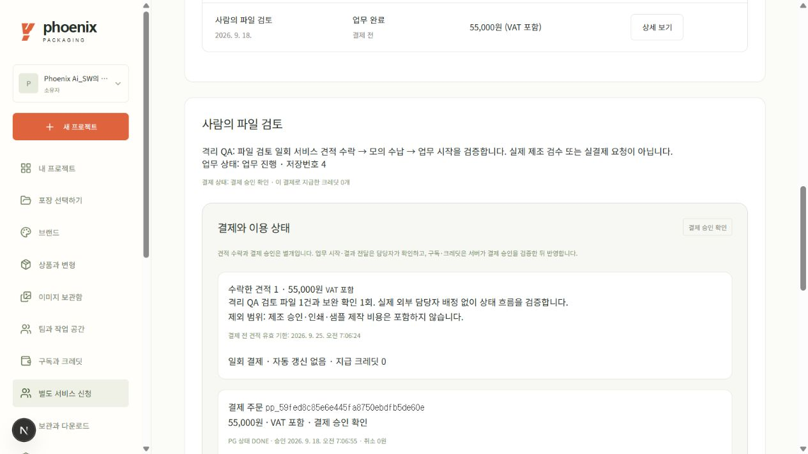
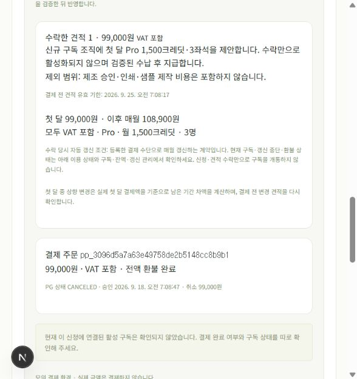
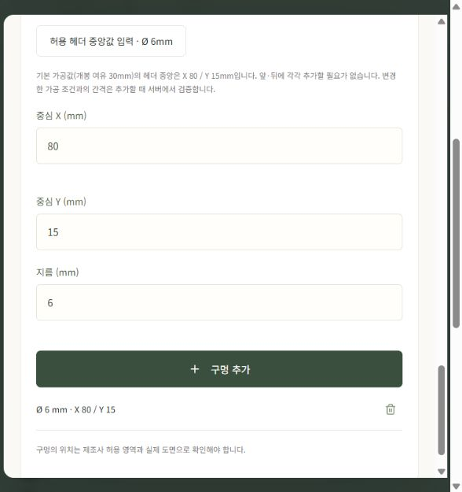
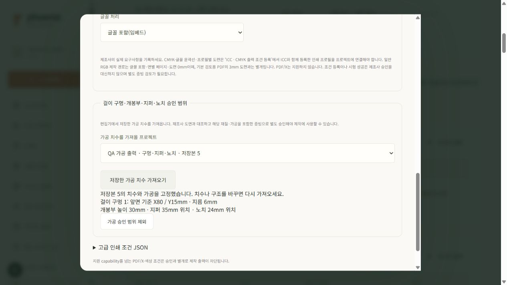
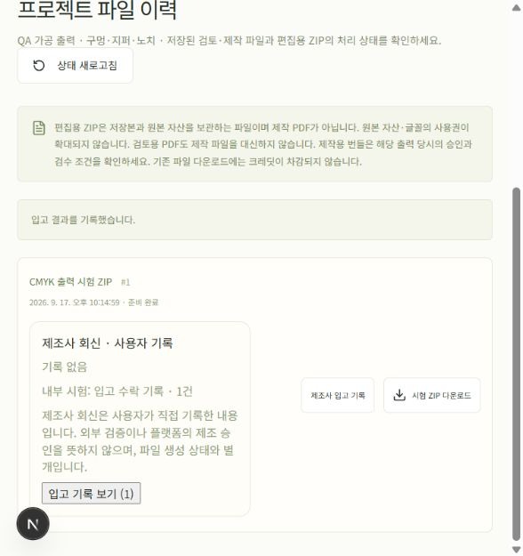
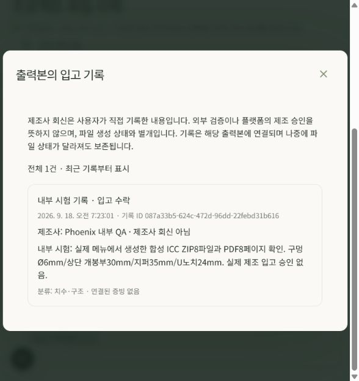
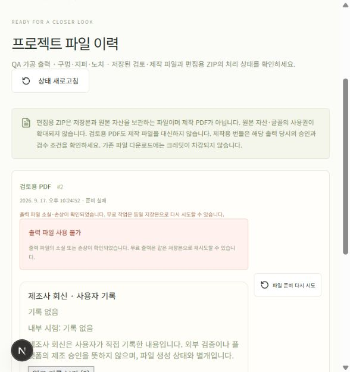
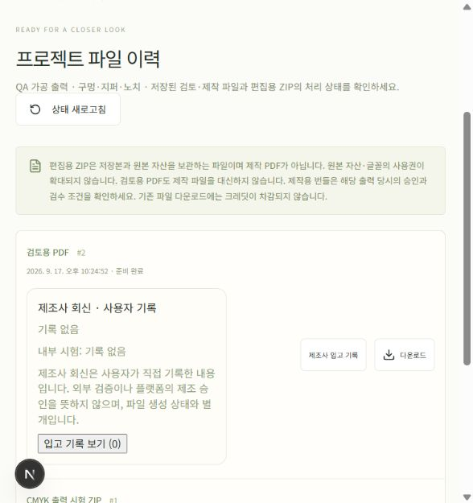

# 서비스 결제와 파우치 가공 출력 사용 기록

2026-09-18 격리 로컬 UI에서 실제로 수행한 순서와 결과다. 서비스 결제는 **MockProvider 모의 결제**, 가공 파일은 **합성 ICC의 무료 시험 출력**이다. 실제 카드 청구·유료 AI 호출·제조사 승인·실물 가공을 수행하지 않았다. 이번 변경의 운영 배포 및 운영 화면 검증은 이 문서 작성 시점에 미완료이며 별도 기록한다.

새 PDF 매뉴얼은 `output/pdf/checkout-finishing-manual.pdf`, 생성기는 [`scripts/build-checkout-finishing-manual.py`](../scripts/build-checkout-finishing-manual.py)다. 이전 매뉴얼을 덮어쓰지 않는다. `output/`은 이 작업 PC의 별도 전달 자료이며 Git 문서의 공개 첨부가 아니다.

## 1. 일회 파일 검토: 견적 수락과 결제를 따로 확인

1. **별도 서비스 신청**에서 파일 검토를 선택하고 대상 프로젝트와 요청 내용을 입력한다.
2. 신청 상세에서 담당자의 견적 금액, VAT 포함 여부, 제공·제외 범위, 유효 기한을 확인한 뒤 수락한다.
3. **결제와 이용 상태**에서 결제를 요청한다. 실서비스에서는 연결된 Toss 결제창을 사용하지만, 이번 QA는 표시된 **모의 결제 승인 확인**만 실행했다.
4. 결제 결과가 불명확하면 **결제 상태 재조회**를 사용한다. 결제 완료와 업무 진행 상태는 각각 확인한다.

실제 로컬 결과: VAT 포함 **55,000원** 견적 수락 → 모의 수납 완료 → 담당자가 **업무 진행 중**으로 변경했다. 일회 서비스로 크레딧이나 구독을 지급하지 않았다. 업무 시작 이후에는 자동 전액 환불이 제한되며 담당자 확인이 필요하다. 이 기록은 사람의 실제 파일 검토가 제공되었다는 증거가 아니다.

## 2. 첫 달 Pro: 별도 동의와 현재 구독 상태

- 이번 수락 조건은 첫 달 **99,000원**, 이후 매월 **108,900원**, 모두 VAT 포함이다. 월 **1,500크레딧·3좌석** 조건을 확인했다. 실제 결제 전에는 해당 견적의 고정된 금액과 조건을 다시 확인한다.
- 견적 수락만으로 자동 갱신에 동의한 것으로 처리하지 않는다. 첫 금액·다음 금액·자동 갱신을 확인하는 별도 체크 전에는 결제 버튼이 비활성인 것을 실제 UI에서 확인했다.
- 모의 승인 뒤 1,500크레딧과 Pro 이용 상태가 반영됐다. **구독·잔액·갱신 관리**에서 갱신을 중단했을 때 현재 이용 기간은 유지됐다.
- 지급분이 전혀 사용되지 않은 상태에서 모의 전액 환불을 요청했다. 환불 완료와 구독 취소가 표시됐고, 체험 **30크레딧**은 남았다. 견적·결제·환불 이력은 보존됐다.

수락 당시 자동 갱신 조건은 과거 계약 기록이다. 환불·갱신 중단 이후의 현재 상태는 연결된 결제와 구독 정보로 확인한다. 첫 달 중 상향 변경은 실제 첫 달 결제액을 기준으로 남은 기간 차액을 계산하며 별도 변경 견적을 거친다. 자세한 정책과 자동시험은 [서비스 수납 문서](service-checkout.ko.md)에 기록했다. 실제 Toss 승인·빌링키·갱신·취소·웹훅은 이번 로컬 모의 검증과 구분한다.

## 3. 파우치 구조: 그림과 가공선을 구분

편집기의 구조 도구에서 개봉부·지퍼·뜯는 노치를 지정하고 걸이 구멍을 추가한다. 아래 값은 이번 **160×230mm 시험 파우치**의 기록이며 모든 제조사에 적용하는 권장 규격이 아니다.

| 항목 | 실제 입력·출력 값 |
|---|---|
| 걸이 구멍 | 원형 지름 6mm, 앞면 중심 X80/Y15mm |
| 개봉부 | 높이 30mm |
| 지퍼 | 중심 Y35mm, 대역 6mm (Y32~38mm) |
| 뜯는 위치·노치 | Y24mm, 양측 U 모양 깊이 3mm·높이 4mm |
| 문구 | 앞·뒷면의 상단 문구를 Y55mm로 이동 |
| 외곽 도련 | 사방 3mm |

좌표의 원점은 해당 면의 왼쪽 위이며 단위는 mm다. 구멍과 노치는 실제 비인쇄 영역으로 반영하고, 지퍼·개봉 참고선은 별도 가공 안내에 표시한다. 개봉 참고선은 미싱·레이저 절취 명령을 뜻하지 않는다. 중요 문구가 가공부·안전 영역과 겹치면 위치를 보완한 뒤 다시 검수한다.

## 4. 무료 CMYK 시험 ZIP과 실제 파일 확인

**검수와 출력 → CMYK 출력 시험 → 무료 시험 ZIP 만들기 → 파일 이력**으로 진행했다. 완료 파일은 0크레딧이며 실제 인쇄용 승인을 만들지 않는다.

| 파일 | 용도 |
|---|---|
| `production.pdf` | CMYK 변환·문구 윤곽선·구멍/노치 비인쇄 영역을 반영한 시험 아트 |
| `cut.pdf` | 외곽·원형 타공·U 노치의 재단 경로 |
| `fold.pdf` | 접힘 경로. 이번 분리 삼방 면에는 접힘선이 없음 |
| `process.pdf` | 실링·개봉부·지퍼 위치와 가공 배치 안내 |
| `finishing.json` | 면별 가공 좌표와 동결된 물리 명세 |
| `manifest.json`, `preflight.json`, `preview.png` | 파일 해시·검수·미리보기 |

실제 UI 작업 `0f2d102d-6d94-42d0-916c-e97bec1d3211`이 완료됐다. ZIP은 **8개 파일·431,850바이트**, SHA-256은 `5999a6255a2b2cffefb99d8de1d62a87f3611f63dd9bef4d4711f56e5b34807c`다. 아트·CUT·FOLD·PROCESS 각 앞/뒷면, **총 8 PDF 페이지를 Poppler로 렌더해 전수 시각 확인**했다. 실물 인쇄물의 색상·가공 정밀도를 검증한 것은 아니다.

원본 파일과 읽기 검수 자료는 `output/checkout-finishing-ui/`에 있다. `verification.json`에는 로컬·모의 환경, 완료 작업, 0크레딧, 제조 미승인, 전체 8페이지 확인을 기록했다. 매뉴얼의 PDF 그림은 해당 원본 출력의 렌더이며 패키지 디자인을 재생성하지 않았다. 스크롤 전체 캡처에서 겹쳐 붙은 화면은 매뉴얼에서 제외하고 원본 viewport 캡처를 사용했다.

## 5. 실제 제작 전에 별도로 필요한 것

제조사·재질·정확한 치수·가공값·ICC 프로필과 증빙이 일치하는 승인 도면이 필요하다. 관리자에서 프로젝트의 가공값을 가져오는 동작은 값 복사이며 제조사 승인이나 입고 승인을 대신하지 않는다. 승인 전 제작 출력 차단은 유지된다.

관리자 초안에서 이번 프로젝트 저장본 5의 실제 가공값을 가져온 뒤 폭을 160mm에서 170mm로 바꾸자 기존 가공 선택이 해제되는 것을 로컬 UI로 확인했다. 새 도면 등록이나 승인 실행은 하지 않았다.

이번 기능은 원형 걸이 구멍과 U/V 노치의 지원 범위에 한정된다. 임의 SVG 칼선, 원형 이외 걸이 구멍, 외곽 둥근 모서리, 미싱·레이저 절취, 곡선 접힘, PDF/X 인증, 별색·화이트판·오버프린트·반투명은 지원한다고 표시하지 않는다. 자세한 범위는 [가공 출력 엔진 문서](pouch-finishing-engine.ko.md)를 참고한다.

최초 매뉴얼 6쪽은 그대로 보존하고 로컬 입고 기록과 무료 출력 손상·재시도 복구의 후속 실증을 각각 1쪽 부록으로 추가했다. 유료 출력 보상과 운영 배포·장애 복구의 실증은 포함하지 않는다. 이 문서는 전체 요구사항 완료 선언이 아니다.

## 부록. 내부 시험 입고 기록의 실제 조회

로컬 QA 재시작 후 같은 프로젝트·시험 ZIP 작업 `0f2d102d-6d94-42d0-916c-e97bec1d3211`의 **파일 이력 → 제조사 입고 기록**에서 기본 출처인 **내부 시험**을 유지하고 수락 상태를 기록했다. 제조사 표시에는 **Phoenix 내부 QA · 제조사 회신 아님**을 입력하고, 합성 ICC ZIP 8개 파일·PDF 8페이지 확인과 가공값을 메모했다. 실제 제조사 회신과 입고 승인을 기록한 것이 아니다.

저장 후 요약은 제조사 회신 **기록 없음**, 내부 시험 **입고 수락 기록 · 1건**으로 표시됐다. **입고 기록 보기**에서 기록 `087a33b5-624c-472d-96dd-22febd31b616`의 출처·수락 상태·제조사 표시·메모를 다시 읽을 수 있음을 확인했다. 연결된 증빙은 없으며 외부 검증으로 표시하지 않는다.

PDF 부록은 이 두 원본 viewport 캡처를 사용한다. 기존 1~6쪽의 렌더는 이전 PDF와 비교해 동일 여부를 확인하고, 추가 7쪽을 별도로 시각 검수한다. 실제 제조사 회신·제작 승인·운영 배포 검증은 이 부록의 근거가 아니다.

## 후속 부록. 손상된 무료 검토 PDF의 실제 재시도

격리 로컬 QA에서 무료 검토 작업 `837c5051-2c88-45a3-a554-886feef3c43e`의 정상 PDF와 동결 저장본을 먼저 확인했다. 해당 로컬 파일만 의도적으로 손상시킨 뒤 **시험 시계 0초·301초**에 실제 무결성 확인 경로를 실행했다. 시험 시계를 앞당긴 검증이며 **실제 5분 동안 기다린 시험이 아니다**.

손상이 재확인된 작업은 실패·사용 불가로 표시되고 다운로드가 사라졌다. 실제 **파일 이력 → 파일 준비 다시 시도** 버튼을 눌러 같은 작업을 다시 실행하자 완료 상태와 다운로드가 돌아왔다. 새 작업이나 새 유료 주문을 만들지 않았다.

재생성된 PDF는 **22,837바이트**이며 SHA-256 `e5ecf729f5dc2eb54704418e0757c4b5798b5944baeb54c6c1d3a4a6cee094b8`이 손상 전 원본과 정확히 일치했다. 동결 저장본은 바뀌지 않았다. 유료 예약·유료 API 호출·운영 파일 변경은 없었다. 무료 출력 복구이며 유료 크레딧 보상, 실제 운영 장애 복구, 제조사 입고 승인 시험을 뜻하지 않는다.

읽기 검증 근거는 `output/checkout-finishing-ui/recovery/verification.json`이다. 현재 성공 상태와 손상 확인 당시 상태를 구분해 읽는다. PDF 8쪽에 두 원본 화면과 결과를 추가했으며 기존 1~7쪽의 렌더·텍스트는 이전 PDF와 비교해 보존한다. 이는 이번 매뉴얼의 마지막 추가 부록이다.
