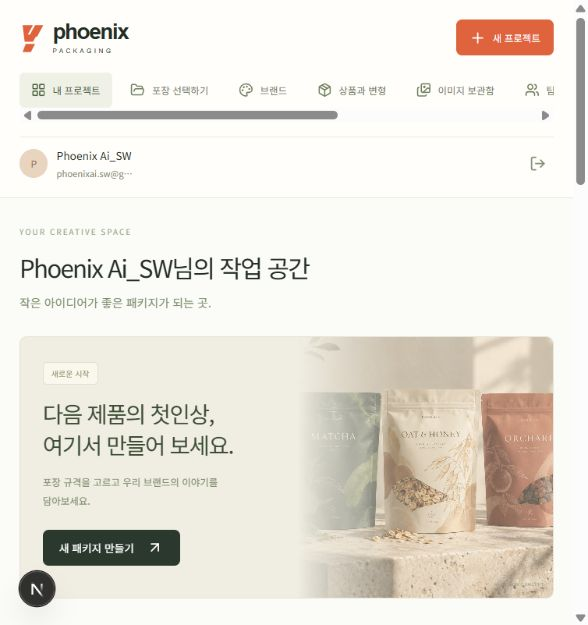
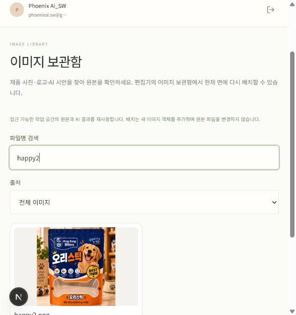
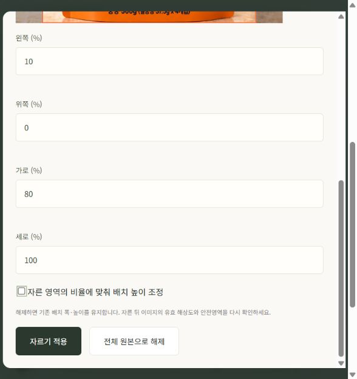
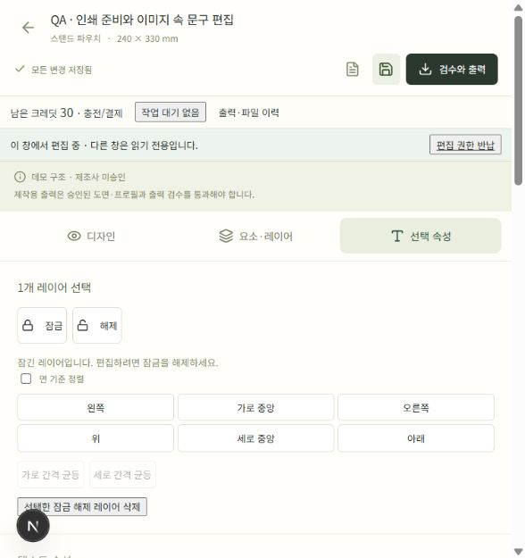
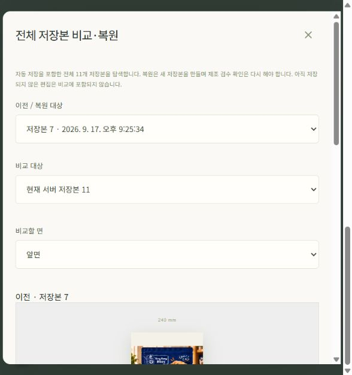
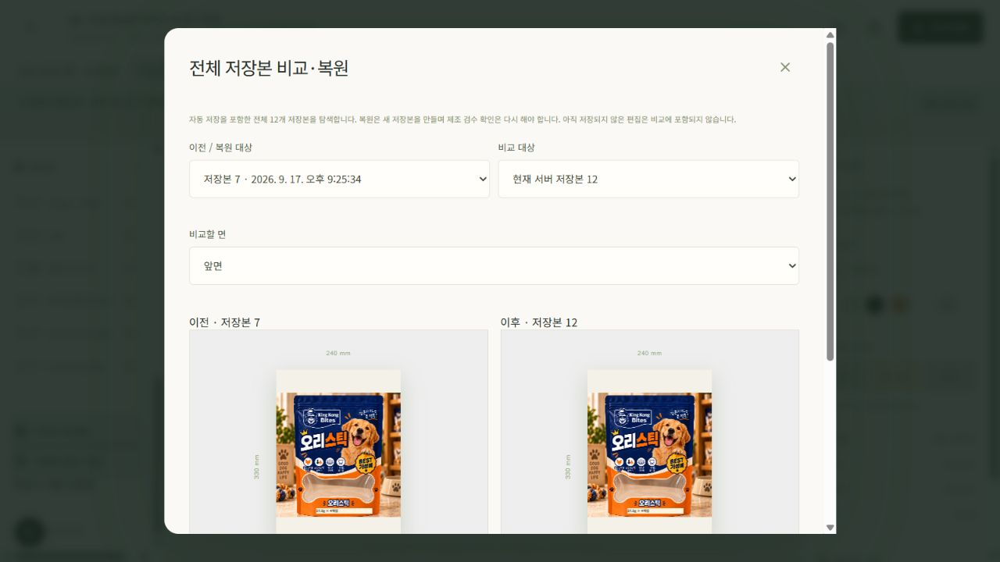
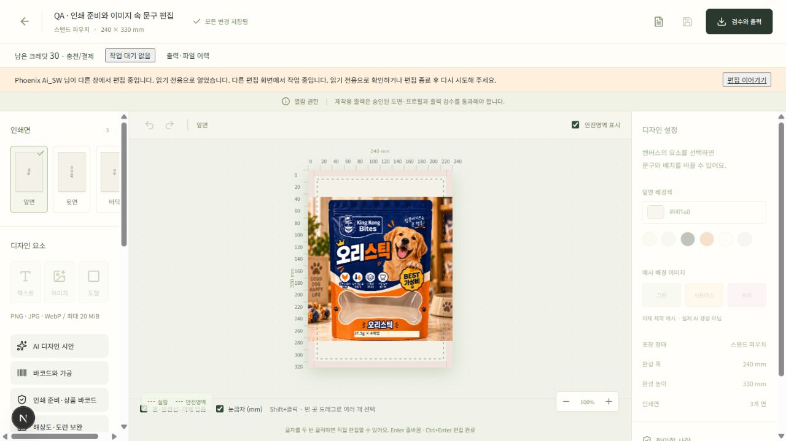
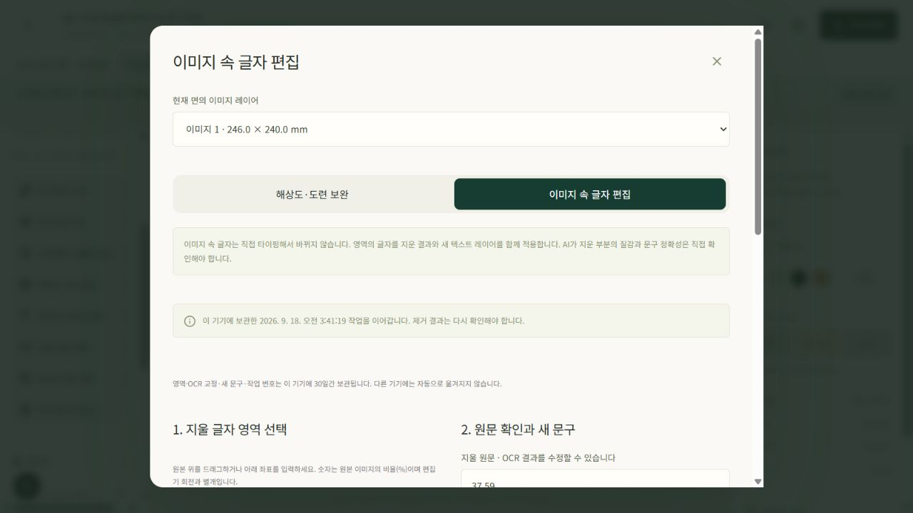
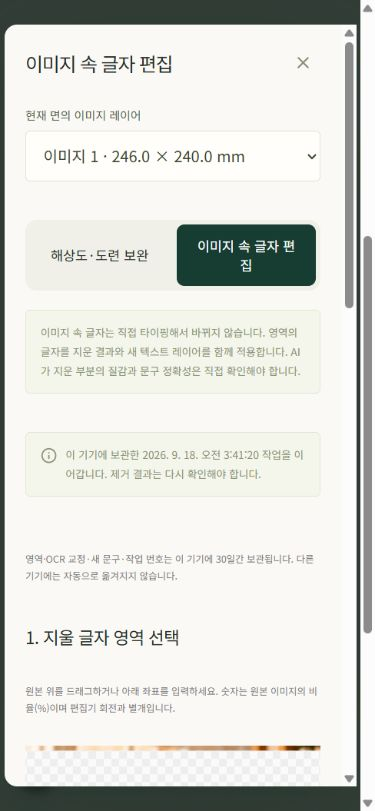

# 편집·복구 1차 보완 — 사용 방법과 로컬 검증

2026-09-18. 원문 작업지시서에서 누락됐던 편집·복구 기능을 보완한 **로컬 후보 버전** 기록이다. **이 변경의 운영 배포는 아직 완료되지 않았다.** 기존 Google 운영 로그인과 실제 AI 연동은 이미 검증됐으며, 이번 편집 보완의 검증과 구분한다. 제조 출력·실제 결제·운영 관리까지 포함한 전체 개발 완료 보고가 아니다. 전체 남은 범위는 [요구사항 추적표](spec-completion-tracker.ko.md)에 있다.

서버 전체 자동시험은 **531개 통과**했다. 프런트 자동시험은 **57개 통과**했다. 마지막 수정본의 **타입 검사·빌드도 모두 통과(exit 0)**했다. 아래 화면은 로컬 실제 브라우저에서 촬영했으며 운영 고객 디자인이나 실제 결제 결과가 아니다.

## 메뉴 사용 순서

| 작업 | 사용하는 방법 | 확인할 점 |
| --- | --- | --- |
| 이미지 자르기 | 이미지를 선택하고 **선택 속성 → 이미지 자르기**를 연다. 원본 위를 드래그하거나 왼쪽·위쪽·가로·세로를 %로 입력한 뒤 **자르기 적용**을 누른다. | 원본 파일을 바꾸지 않는다. 비율 유지 옵션은 배치 높이를 조정하며, 옵션을 끄면 현재 폭·높이를 유지한다. **전체 원본으로 해제**로 되돌릴 수 있다. 자른 만큼 유효 픽셀이 줄어들므로 출력 검수를 다시 한다. |
| 글자 간격·투명도 | 텍스트를 선택해 **자간(pt)**·**행간(배수)**을 조절한다. 텍스트·이미지·도형은 **불투명도**로 조절한다. | 바코드에는 자유 투명도·크기 변형을 제공하지 않는다. 문구는 이미지에 다시 그리지 않고 독립 텍스트로 유지한다. |
| 잠금·해제 | 레이어를 선택하고 속성 상단의 **잠금** 또는 **해제**를 누른다. | 잠긴 객체는 속성·이동·크기·순서·삭제·상품 연결 반영을 막는다. 잠금은 실수 방지 기능이며 조직 접근 권한과는 별개다. |
| 여러 객체 이동·정렬 | Shift/Ctrl/⌘+클릭, 레이어 체크박스 또는 빈 캔버스에서 드래그하여 여러 객체를 선택한다. 정렬 방향이나 **가로/세로 간격 균등**을 선택한다. | 분배는 잠금 해제된 객체 3개 이상이 필요하다. **면 기준 정렬**을 켜면 면을 기준으로 정렬한다. 잠긴 객체는 움직이지 않는다. |
| 정밀 배치 | 하단의 **면·안전선·객체 맞춤**, **눈금자(mm)**를 켠다. 방향키로 1mm, Shift+방향키로 10mm 이동한다. | 회전된 객체의 외곽을 기준으로 맞춘다. 자동 맞춤이나 눈금자가 제조 공차를 보증하지 않는다. 입력창·한글 조합 중에는 편집 단축키를 가로채지 않는다. |
| 저장본 비교·복원 | **저장본 탐색·복원**에서 이전/비교 저장본과 면을 고른다. 이전 항목은 **더 불러오기**로 탐색한다. 변경 목록을 확인하고 복원 확인 후 실행한다. | 복원은 새 저장본을 만들고 과거 기록을 유지한다. 전체 면·확정 문구 확인은 초기화되므로 재검수한다. 잠긴 객체가 바뀌는 복원은 먼저 해제해야 한다. **텍스트 변경 기록**의 최근100개 비교와 별도 메뉴다. |
| 다른 창에서 작업 | 먼저 연 편집창이 편집 권한을 가진다. 다른 창은 읽기 전용으로 확인한다. 첫 창에서 저장 후 **편집 권한 반납**, 다른 창에서 **편집 이어가기**를 누른다. | 종료/통신 문제로 반납되지 않으면 만료 후 다시 확인한다. 편집권을 얻어도 서버 버전이 바뀌었다면 내 미저장본을 덮지 않고 충돌을 안내한다. |
| 이미지 글자 편집 이어하기 | **이미지 속 글자 편집**에서 영역·교정 원문·새 문구를 입력한 뒤 같은 기기·계정·작업 공간에서 다시 연다. | 중간 입력과 작업 번호는 이 기기에 30일간 보관한다. 다른 기기로 자동 이동하지 않는다. 결과는 다시 확인해야 하며, 다시 열었다고 유료 생성이 시작되지는 않는다. 저장소 오류나 미확인 요청은 안내에 따라 최신 작업/이전 요청을 확인한다. |
| 이전 이미지 재사용 | **이미지 보관함**에서 이름·출처로 찾는다. 편집기 안의 보관함에서 선택하면 현재 면의 안전영역에 새 이미지 레이어로 배치한다. | 기존 원본 파일은 유지한다. 현재 작업 공간에서 접근 가능한 자산만 조회한다. 브랜드 폰트 관리 기능과는 별개다. |
| 잔액·오류·도움말 | 편집기 상단에서 잔액·작업·파일 이력을 확인한다. 출력 검수의 **해당 레이어·면 확인**으로 오류 위치를 연다. **편집기 사용 도움말**에서 전체 흐름을 확인한다. | 상태 조회 실패는 별도로 표시한다. 0크레딧과 조회 실패를 같은 상태로 처리하지 않는다. 제작 차단 사유는 편집 완료와 별도로 해결해야 한다. |

## 실제 로컬 화면에서 확인한 범위

아래는 화면에서 확인한 사실과 조작 완료 여부를 구분한다. 캡처에 메뉴가 있다는 이유만으로 적용·서버 저장·복원까지 완료했다고 판정하지 않는다.

| 항목 | 현재 확인한 실제 증거 | 아직 이 기록만으로 주장하지 않는 범위 |
| --- | --- | --- |
| 대시보드 | 내 작업 공간·프로젝트 시작 화면 진입 | 이 캡처에는 모든 요약 숫자가 보이지 않으므로 잔액/작업 상태의 모든 경우 실증으로 쓰지 않음 |
| 이미지 보관함·정렬 | `happy2` 검색 → 새 이미지 레이어90×90mm·X75/Y120 배치 → 기존 텍스트와 동시 선택/왼쪽 정렬로 텍스트X75 확인 → 실행 취소2회·저장으로 원래6레이어 복귀 | 모든 권한·출처·정렬 방향·3개 이상 분배 조합을 실기로 전수 검증한 것은 아님 |
| 자르기 | 왼쪽10%·위쪽0%·가로80%·세로100%를 적용하고 **지금 저장** 후 서버 저장본11의 crop과 비교에서 반영 확인 | 아래 폼 캡처는 적용 전 장면이다. 이번 로컬 저장을 운영 반영·최종 제조 PDF 검증으로 해석하지 않음 |
| 텍스트 잠금 | 잠금 후 속성·삭제·표시/숨기기·순서 변경 비활성 확인, 이후 해제 | 네이티브 키보드·한글 조합까지 모든 조작을 실증한 것은 아님 |
| 저장본 비교·복원 | 저장본7과11 비교 → **7 복원으로 새 저장본12 생성** → 7과12의 디자인 변경0건 확인 | 과거 저장본을 덮거나 과거 결제/출력을 되돌린 결과가 아님 |
| 검수 오류 위치 | 검토 검수의 원본132.71PPI 경고에서 **해당 레이어·면 확인** → 모달 닫힘·원본 이미지 선택·속성 열림 확인 | 경고 위치 이동의 성공이며 원본 PPI 부족을 해결한 결과는 아님 |
| 두 탭 편집권 | 두 번째 탭 읽기 전용 확인 → 첫 탭 권한 반납 → 두 번째 탭 **편집 이어가기 성공** | 네트워크 단절·강제 종료·권한 만료 모든 조합의 실제 시험은 별도 |
| 모바일 | **390×844** 화면에서 도구 탭 → 이미지 속 글자 편집 접근·초안 복원 안내 확인, 레이아웃 검토 | 모든 터치 편집/자르기/분배/내보내기까지 모바일 전수 실행한 것은 아님 |
| 글자 편집 재개 | 영역10/72/80/20%, 교정 전 원문 `37.59`, 새 문구 `37.5g×4개입` 입력 → 닫기 → 재열기로 실제 값 복원 확인 | **유료 생성은 실행하지 않았다.** 원문은 OCR 오인식 시험값이며 상품 확정 문구가 아님. 모든 불확실 응답 복구의 실증도 아님 |

프로젝트를 시작하는 화면이다. 실제 운영의 전체 최신 잔액·작업 수를 보여주는 증거가 아니다.

기존 원본을 찾은 화면. 이후90×90mm 새 이미지로 배치하고 기존 텍스트와 왼쪽 정렬을 확인한 뒤 실행 취소와 저장으로 원래 디자인에 복귀했다. 파일을 다시 업로드하지 않았다.

원본 기준 비율 좌표로 자르기를 지정한다. OCR의 글자 제거 영역과 일반 이미지 자르기는 별도 기능이다.

상단의 30크레딧은 로컬 시험 계정 값이며 운영 잔액을 충전한 기록이 아니다.

이전 저장본과 비교할 면을 선택한 상태다. 이후 저장본7을 복원해 새 저장본12를 만들었고, 아래 비교에서 디자인이 같음을 확인했다. 저장되지 않은 입력은 서버 저장본 비교에 포함되지 않는다.

저장본 수가12개로 늘었으며, 복원 후7과12의 디자인 변경은0건이었다. 이전 저장본11도 그대로 보존된다.

첫 창의 편집 권한을 공유하거나 자동으로 빼앗지 않는다. 읽기 전용 창도 기존 디자인을 확인할 수 있다. 이 화면 확인 뒤 첫 창의 반납과 다른 창의 편집 이어가기를 실제로 수행했다.

이번에는 영역·원문·새 문구 입력을 닫기/재열기로 복원했다. 유료 제거 작업은 새로 시작하지 않았다. 기존 완료 결과를 다시 열더라도 적용 전 재검토는 필요하다.

도구 탭에서 접근해 초안 복원 안내를 확인했다. 작은 화면에서도 같은 편집 내용을 이어서 확인할 수 있음을 검증한 범위다.

## 검증과 남은 범위

서버 531개 회귀에는 기존 인증·정산·업로드·AI·출력과 이번 편집권/이력·자르기·자산 조회 검증이 포함된다. 프런트 회귀는 회전 외곽 정렬·서로 다른 폭의 균등 간격·잠긴 이웃 보존·crop 좌표·lease 헤더와 읽기 전용 차단·과거/현재 장면 비교를 확인한다. 서버 시험 수와 프런트 수를 중복 합산해 인수 항목 수처럼 표시하지 않는다.

이번 결과에는 **네이티브 Windows IME 조합 중 Enter**, 실제 PG 결제, 제조사 승인/실물 입고, 최신 PostgreSQL/PITR 복원, 브랜드 폰트 관리, 전체 편집 ZIP, 관리자 정책/지원/수동 조정 등의 완료 증거가 없다. 실제 제조용 geometry·CMYK/ICC·PDF/X·분리 칼선 출력도 이번 편집 보완으로 지원 범위가 늘어난 것이 아니다. [전체 추적표](spec-completion-tracker.ko.md)와 [편집권·이력 계약](editor-history-leases.ko.md)을 함께 확인한다.
