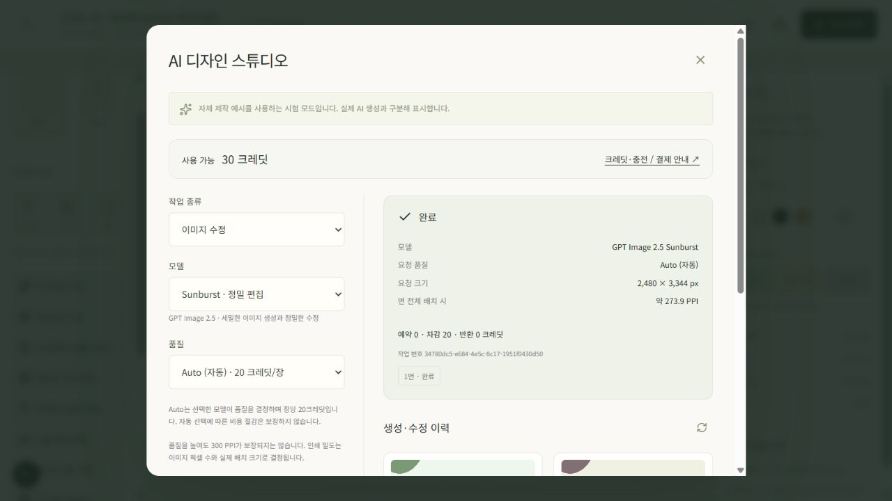

# 이미지 모델·품질 선택 확장

작성일: 2026-09-18. 이 문서는 GPT Image 2.5 Sunburst/Flare와 6개 품질 선택의 사용 방법·계약·검증 범위를 기록한다. 서버 계약·모의 호출·독립 보안 회귀와 로컬 브라우저 실행을 확인했다. 아래 미수행 항목을 실제 유료 생성 성공으로 해석하지 않는다.

## 메뉴에서 사용하는 방법

1. 프로젝트 편집기 왼쪽 **AI 디자인 시안**을 연다.
2. **이미지 생성** 또는 **이미지 수정**을 고른다. 수정은 현재 면에 연결된 원본 이미지도 선택한다.
3. **모델**에서 Sunburst 또는 Flare를 선택하고, **품질**에서 low·medium·high·xhigh·max·auto 중 하나를 선택한다.
4. 프롬프트와 생성 수량을 입력하고 **크레딧 견적 확인**을 누른다. 모델·요청 품질·예상 출력 픽셀·면 전체 배치 시 PPI·필요 크레딧을 검토한다.
5. **확인하고 작업 시작**을 누른다. 선택을 변경했다면 새 견적을 받아야 한다.
6. 완료 후 요청 정보와 차감·반환을 확인하고, 생성·수정 이력의 **이 면의 배경으로 적용**을 누른다. 요청 품질과 실제 응답 품질은 따로 표시된다.

품질 선택에서 `auto`는 모델을 자동 교체하는 옵션이 아니다. 선택한 모델이 출력 품질을 결정하며, 플랫폼 단가는 장당 20크레딧이다. 체험 크레딧은 표준 작업에만 사용할 수 있어 상단 전체 잔액과 견적의 '이 작업에 사용 가능' 잔액이 다를 수 있다.

## 실제 메뉴 실행 기록

아래 화면은 **로컬 fixture 시험**이며 OpenAI가 실제 생성한 이미지가 아니다. 운영 프로젝트·운영 크레딧·외부 유료 API를 변경하지 않았다.

- 프로젝트: `LOCAL QA · Flare와 Sunburst 6단계 품질`, 230 × 310 mm.
- Flare/low 견적 10크레딧 확인 → max로 변경 → 이전 실행 버튼 폐기 확인 → max 견적 20크레딧으로 모의 생성 완료.
- 생성 결과를 현재 면의 배경에 적용하고 기존 텍스트와 함께 저장.
- 이미지 수정 모드에서 해당 원본을 선택 → Sunburst/auto 견적 20크레딧 확인 → 모의 수정 완료.
- 요청 크기 2,480 × 3,344 px, 예상 273.9 PPI를 표시. 실제 모의 결과의 픽셀 크기와 요청 품질 이력도 확인.
- 두 작업에서 합계 40개의 로컬 시험 크레딧만 사용. 운영 계정 크레딧은 변경하지 않음.
- 페이지 새로고침 후 두 결과와 요청 품질·실제 픽셀 이력이 복원됨을 확인.
- 로컬 유료 범위 시험 크레딧 소진 후 체험 30개만 남은 상태에서 xhigh 견적이 차단됨을 확인. 품질 설명에 체험 크레딧 적용 범위를 명시했다.

이 화면은 UI·작업·원장 연결을 증명한다. Sunburst/Flare의 실제 시각적 품질이나 속도 비교를 증명하지 않는다.

## 선택과 크레딧

두 모델을 직접 선택한다. 기본값은 **Sunburst / high**다. 품질과 이미지 픽셀 크기는 별개이며, 면 비율을 반영하는 기존 출력 크기 계산 정책은 유지한다.

| 품질 | 생성·수정 1장당 크레딧 | 동작 |
|---|---:|---|
| `low` | 10 | 선택한 품질을 제공자에게 전달 |
| `medium` | 10 | 선택한 품질을 제공자에게 전달 |
| `high` | 10 | 기본 품질 |
| `xhigh` | 20 | 상위 품질 |
| `max` | 20 | 최고 품질 설정; 처리 시간·시각적 결과 보장 아님 |
| `auto` | 20 | 모델이 품질 결정; 실제 선택 품질과 관계없이 사전 견적 20으로 고정 |

위 크레딧은 플랫폼 이용 단가이며 OpenAI의 토큰별 청구액과 다르다. 생성은 1~3장, 이미지 수정과 영역 글자 제거는 1장이다. 잔액 부족은 예약 전에 차단하고 성공분만 확정한다. 품질 명칭 `high`와 과금 작업 종류의 `.high`를 혼동하지 않는다. `low/medium/high`는 `image.generate.standard` 또는 `image.edit.standard`, `xhigh/max/auto`는 각각의 `.high` 작업이며 명시적 불일치는 422다.

상위 품질은 운영 설정이 활성화되어 있어야 하며 체험의 표준 전용 크레딧으로 사용할 수 없다. 모델 목록 조회 성공이나 표준 크레딧 잔액만으로 상위 품질의 이용 가능 상태를 판단하지 않는다.

신규 요청은 최상위 `model`, `quality`만 사용한다. 중첩 `input_data`에서 같은 항목을 보내는 우회 경로는 허용하지 않는다. 기존 호출 호환을 위한 생략값은 standard 작업이면 high, `.high` 작업이면 xhigh다. UI는 두 값을 명시하여 견적을 요청한다.

## 고정되는 값과 작업 이력

- 견적에 선택 버전 `packaging-image-selection-v1`, 모델·품질·작업 종류·크기 정책·단가를 고정한다. 실행 요청은 견적 ID만 받는다. 모델·품질·원본·프롬프트·면·수량이 달라지면 새 견적을 받는다.
- 실행기는 견적의 선택을 실제 Image API에 전달한다. 신규 견적 생성 후 기본 모델 설정만 바뀌어도 이미 선택한 모델을 임의 대체하지 않는다. 허용 모델 목록이나 계정·팀·작업 공간 권한이 철회되면 유료 호출 전과 결과 공개 전에 다시 검사하고 미제공 결과의 예약을 반환한다.
- 요청 품질과 응답에 기록된 실제 품질을 구분한다. `auto` 응답의 실제 품질 필드가 없으면 미확인으로 남긴다. 요청 크기와 실제 이미지 픽셀도 따로 기록한다.
- 제공자 요청 ID·사용량·추정 비용은 저장 실패/권한 변경으로 고객에게 결과를 제공하지 못한 경우에도 보존한다. 비밀키·인증 헤더·원시 오류 응답은 사용자 이력으로 내보내지 않는다.
- 기존 선택 버전이 없는 저장 작업은 기존 모델·high 품질·예약 단가를 보존하는 호환 경로를 사용한다. 기존 ROI 글자 제거의 영역 외 픽셀 보존과 원본 품질 계보를 유지한다.

## 공식 근거

2026-09-18에 OpenAI 공식 페이지를 직접 열어 확인했다. 두 모델 페이지는 `low`, `medium`, `high`, `xhigh`, `max`, `auto`를 명시한다. 생성·수정 API는 요청 품질과 선택적으로 반환되는 실제 출력 품질을 별도 필드로 제공한다. 모델 목록 응답을 확인하더라도 해당 계정의 모든 품질 실생성 성공이나 일정 처리 시간을 증명하는 것은 아니다.

- [GPT Image 2.5 Sunburst](https://developers.openai.com/api/docs/models/gpt-image-2.5-sunburst)
- [GPT Image 2.5 Flare](https://developers.openai.com/api/docs/models/gpt-image-2.5-flare)
- [이미지 생성 API](https://developers.openai.com/api/reference/resources/images/methods/generate)
- [이미지 수정 API](https://developers.openai.com/api/reference/resources/images/methods/edit)

이 기능은 Image API의 생성·수정 경로를 사용한다. Flare의 속도 개선율이나 특정 작업의 최대 처리 시간을 플랫폼 보장으로 제시하지 않는다. 문구·바코드·제조 칼선의 결정론적 편집/검수와 제조용 출력 제한은 이 변경으로 해제되지 않는다.

## 처리 시간과 실패 정책

기존 코드 기준 제공자 HTTP 대기 제한은 240초, 연결은 15초다. 작업 임대는 6분, 대기 작업 만료는 10분이다. Vercel API/웹 함수 최대 800초, 서버 후속 worker 요청은 750초로 설정되어 있어도 제공자 단계의 제한은 별도로 적용된다. 시간 초과·연결 유실처럼 외부 처리 여부가 불명확하면 `reconciliation_required`로 남기고 예약을 반환하며 유료 호출을 자동 중복 실행하지 않는다. 높은 품질이 이 시간 안에 완료되는지는 실제 유료 호출로 검증하지 않았다.

## 검증 기록

| 범위 | 현재 증거/담당 | 상태 |
|---|---|---|
| 공식 모델·품질·생성/수정 파라미터 | 위 공식 4개 페이지 직접 확인 | 확인 완료 |
| 전체 API·결제·도면/PDF 회귀 | `python -m pytest services/api/tests services/api/billing/tests tests/geometry_pdf -q` | **497개 통과**, 714.21초; 아래 관련 시험 포함 |
| 기존 크레딧·권한·ROI 보존 기반 | `test_ai.py`, `test_image_text_removal.py`, `test_image_sizing.py` | **93개 통과**; 기존 입력 무시 기대 1개를 새 422 계약으로 갱신 후 재검증 |
| 2모델×6품질×생성/수정 전달 | `test_image_quality_selection.py`의 모의 HTTP 24조합 | 통과, 아래 단가·오류 시험과 합계 38개 |
| 품질별 단가·부분 성공·auto 응답 누락 | 같은 파일의 모의 provider/원장 시험 | 20크레딧 3장 중 2성공 시 40확정·20반환, 실제품질 미확인/저장 실패 기록, 체험 범위 차단 통과 |
| 견적 변조·기본 모델 변경·모델 철회·기존 ROI | 독립 `test_image_selection_security.py` | **7개 통과**, 23.13초, 로컬 테스트 환경 |
| 기존 크레딧·결제 회귀 | billing 테스트 묶음 | **68개 통과**; 외부 실제 결제 아님 |
| 선택 변경 시 견적 폐기·요청/실제 품질 이력 | 프런트엔드 테스트·브라우저 검증 | 프런트 42개 통과, 타입 검사·웹 빌드 통과, 위 로컬 생성·수정 흐름 완료 |
| 계정의 모델 목록 조회 | OpenAI 모델별 읽기 전용 조회 | 두 모델 모두 HTTP 200 및 모델 ID 일치; 유료 생성 검증은 아님 |
| 새 6개 품질 실제 생성·편집·처리 시간 | 이번 확장에서 유료 호출하지 않음 | 미수행 |

자동 테스트는 가짜 제공자와 격리된 테스트 DB/Storage만 사용한다. 기존 실제 Sunburst/high 결과는 이전 기능의 증거이며, 신규 12개 모델·품질 조합의 실제 결과로 재사용하지 않는다.

독립 테스트는 모델 또는 품질을 바꾼 견적의 해시 불일치로 무예약 거절하는지, 기본 모델 변경이 신규 고정 선택을 바꾸지 않는지, 모델 철회 시 호출 전·공개 전 각각 예약을 반환하고 이미 발생한 제공자 비용을 남기는지 확인했다. 기존 ROI 작업은 선택 버전 없이도 영역 외 RGBA 픽셀을 보존하고 10크레딧을 유지했다. 기존 `image.generate.high` 작업의 `quality=high`·20크레딧도 새 정책으로 재해석하지 않았다. 마지막 사례는 체험 크레딧을 우회하지 않고 격리된 테스트 DB의 유료 범위 버킷으로 검증했다.

독립 재현 명령: `.venv/Scripts/python.exe -X utf8 -m pytest services/api/tests/test_image_selection_security.py -q`. 테스트 파일은 [독립 선택 보안 회귀](../services/api/tests/test_image_selection_security.py), 모델/품질 조합 시험은 [선택 및 전송 회귀](../services/api/tests/test_image_quality_selection.py)에서 확인한다. 백엔드 담당 실행 결과와 독립 실행을 합친 관련 시험은 중복 제외 **206개**이며, 이후 전체 회귀 합계에 다시 더하지 않는다.
