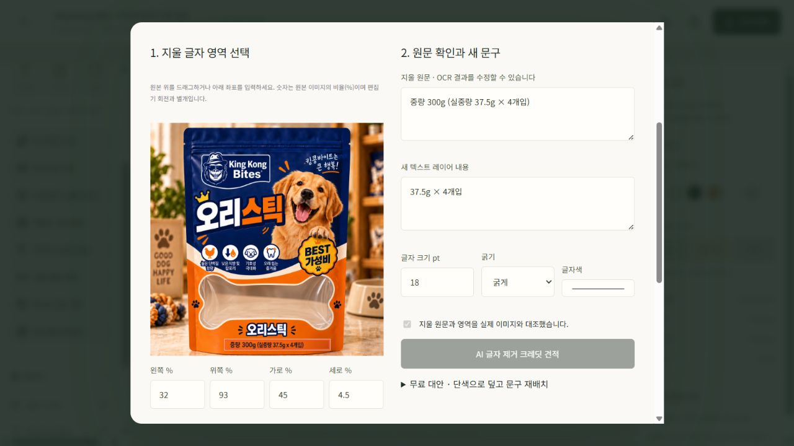
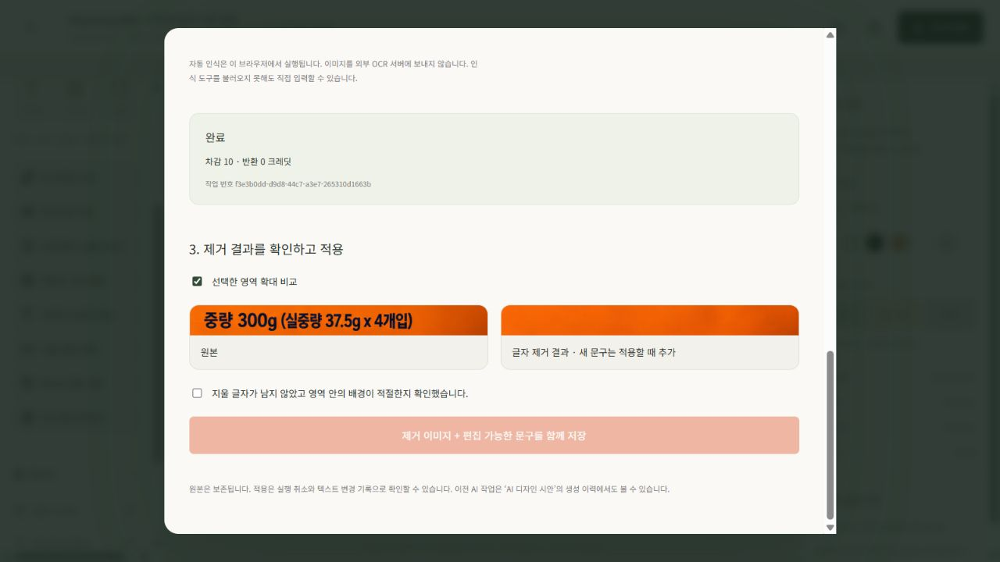
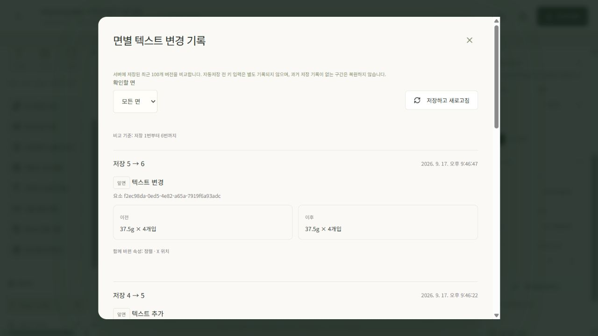
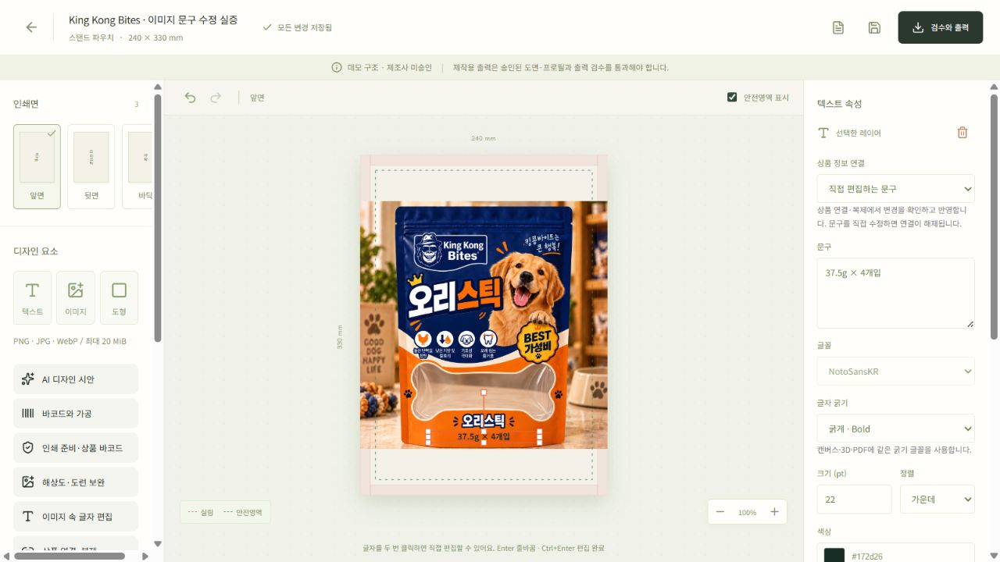
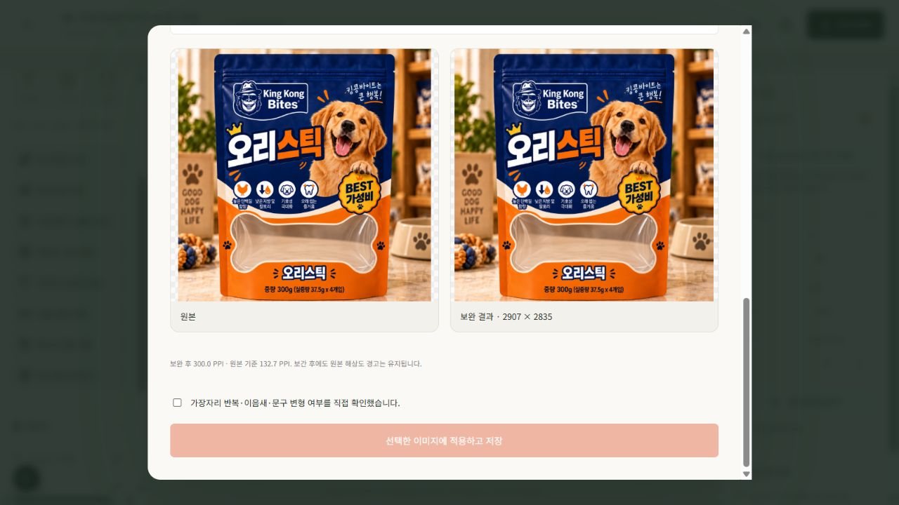
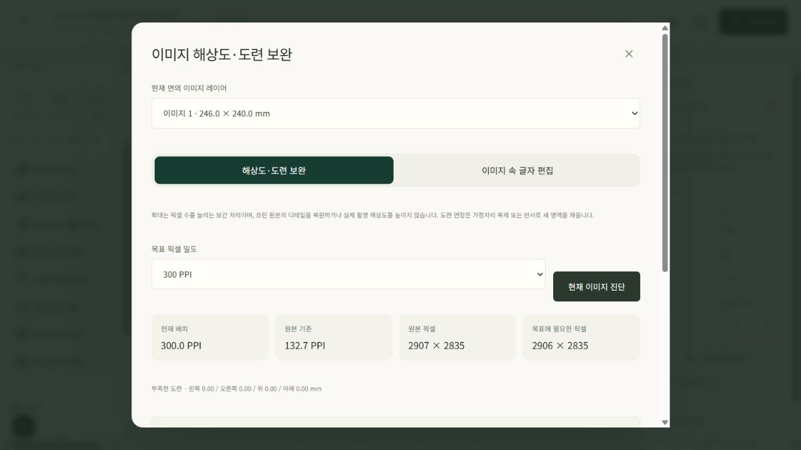

# 인쇄 준비·이미지 글자 편집 — 사용 안내와 운영 검증

작성일: 2026-09-17 · **운영 웹·API 배포와 실제 AI 글자 제거·편집 문구 적용을 확인했다.** 코드 `15369d1`(PR #5), 웹·API 모두 READY. CI에서 Python 450개·JavaScript 36개 테스트와 타입 검사·빌드가 통과했다. 아래 실측은 개별 QA 사례이며 모든 이미지의 편집 품질이나 최종 제조 적합성을 보증하지 않는다.

편집기 왼쪽 도구에서 아래 메뉴를 연다. 원본 프로젝트를 보존하려면 먼저 **상품 연결·복제**에서 사본을 만든다. 텍스트 레이어의 문구는 기존 속성창에서 직접 수정하며, 이미지에 들어 있는 글자만 새 글자 편집 도구를 사용한다.

| 메뉴 | 사용 순서 | 확인할 한계 |
| --- | --- | --- |
| **인쇄 준비·상품 바코드** | 상품 변형 연결 → 정식 EAN-13 입력 또는 배정받은 업체코드·상품 참조번호로 체크 숫자 계산 → 보유 기업·배정 근거·사용 권한 확인 → 중복 검사 및 등록 → **바코드 배치·샘플 교체 메뉴**에서 배치 | GS1 번호 발급이나 소유권 자동 인증이 아니다. 중복 검사는 현재 팀의 상품 목록 범위다. 등록만으로 디자인의 샘플 바코드가 교체되지 않는다. 실제 배정 번호와 상품 연결은 코리안넷·Verified by GS1에서 별도로 확인한다. |
| **인쇄 준비·상품 바코드 → 제조 규격 준비** | 승인 도면·인쇄 조건·소재·치수의 부족 항목 확인 → **도면·소재·인쇄 조건 선택 / 출력 검수** → 최신 저장본 검수 | 제조사 승인서를 대신하지 않는다. 관리자는 운영 관리에서 치수·도련·최소 PPI·색상·PDF·글꼴 조건과 출처·라이선스·증빙을 등록한다. 미지원 조건도 기록할 수 있으나 제작 출력은 차단된다. |
| **해상도·도련 보완** | 이미지 선택 → 현재 이미지 진단 → 확대 보간 및 도련 없음/가장자리 늘리기/반사 선택 → 무료 보완 이미지 준비 → 전후 비교 → 확인 후 적용·저장 | 확대는 원본 디테일 복원이 아니다. 원본 기준 PPI 부족 경고가 유지된다. 도련은 가장자리 픽셀로 채우므로 반복·이음새를 확인한다. 회전된 이미지는 도련 보완 전에 회전을 해제해야 한다. |
| **이미지 속 글자 편집** | 이미지 선택 → 원본 위 드래그 또는 비율 좌표로 영역 지정 → 무료 한국어·영어 OCR 또는 직접 원문 입력 → 오인식 교정·원문 확인 → 새 문구 입력 → AI 제거 견적 확인·시작 → 선택 영역 확대 비교 → 확인 후 이미지와 텍스트를 함께 저장 | OCR 신뢰도는 정확성 보증이 아니다. OCR은 브라우저에서 실행하며 외부 OCR 서버로 이미지를 보내지 않는다. AI 제거 영역 안의 배경 복원 품질은 직접 판단해야 한다. 새 문구는 별도 텍스트 레이어이며 크기·줄바꿈·안전영역을 다시 확인한다. |

**무료 대안:** 이미지 글자 편집의 **단색으로 덮고 문구 재배치**는 사각형 덮개와 텍스트를 추가한다. 원본 픽셀을 지우거나 무늬를 복원하지 않는다. 배경 경계가 보일 수 있으며 덮개를 삭제하면 원래 글자가 다시 보인다. 새 문구를 비우면 제거/덮기만 적용한다.

**저장과 원본 보존:** AI 제거와 이미지 보완은 원본과 별도 자산을 만든다. 적용은 실행 취소로 되돌릴 수 있다. 준비 후 원본 디자인·리비전·제거 영역·원문이 바뀌면 오래된 결과 적용을 막는다. 새 문구와 크기·굵기·색상은 AI를 다시 실행하지 않고 적용 전에 바꿀 수 있다. 메뉴를 닫으면 미확정 원문·영역 입력 세션은 복원되지 않으며, 완료된 AI 이미지는 기존 생성 이력에 남는다.

## 실제 실행 결과

- **운영 글자 편집:** 원본 `happy2.png`(1254 × 1254px)의 하단 글자를 선택했다. 영역은 왼쪽 32%·위쪽 93%·가로 45%·세로 4.5%다. OCR 신뢰도는 **88%**였지만 `37.5g`를 `37.59`로 읽어 원문을 대조·교정했다. AI 제거가 성공한 뒤 **18 → 22pt·굵게**로 바꾸어 재생성 없이 적용했다. 새 문구는 **`37.5g × 4개입`**, 최종 위치는 X 66mm·중앙 정렬이며 저장본 **6**에서 확인했다.
- **보존·사용량 검증:** 제거 영역 밖 **1,540,311개 픽셀의 변경 수는 0**이며, 원본 SHA도 그대로였다. 실제 `gpt-image-2.5-sunburst` 호출은 **1회**, 차감은 **10크레딧**이다. 기록된 외부 모델 비용 **$0.190873은 추정치**다. 이 사례에서 글자 제거와 주변 보존을 확인했으며 다른 이미지의 영역 안 복원 품질까지 보장하지 않는다.
- **이력 구분:** 이미지에 구워져 있던 삭제 대상 원문은 확인·교정한 OCR 원문으로 **AI 작업에 기록**된다. **텍스트 변경 기록**에서는 새 편집 문구가 **텍스트 추가**로 나타난다. 이후 저장 5 → 6에는 문구 자체는 유지되고 **정렬·X 위치 변경**이 기록됐다. 이미지 속 글자가 원래부터 텍스트 레이어였거나 글자 이력에서 직접 수정된 것처럼 해석하지 않는다.
- **로컬 보완·무료 대안:** 확대 보완 후 배치 밀도는 **132.7 → 300 PPI**, 원본 기준은 **132.7 PPI 유지**, 부족 도련은 **3 → 0mm**로 확인했다. 이는 픽셀 보간·가장자리 채움 결과다. 별도 무료 덮개 적용으로 2개 레이어가 추가되었고 한 번의 실행 취소·다시 실행이 성공했다.
- **운영 진단·PDF:** 운영에서도 문구 제거 후 이미지가 1254 × 1254px·132.7 PPI로 진단됐다. 플랫폼의 무료 검토 PDF를 생성해 3개 면과 전개도 총 4페이지를 렌더링·확인했다. 첫 면의 `37.5g × 4개입`은 이미지가 아닌 실제 텍스트로 추출되며 NotoSansKR-Bold 22pt 글꼴이 포함됐다. 한글 깨짐·잘림은 없었다. 이 PDF는 해상도 보완 파일을 적용하지 않은 별도 문구 편집 시험이므로 **132.72 PPI·도련 부족 경고가 남는 검증용 PDF**다. [운영 검토 PDF 이력](https://phoenix-packaging.vercel.app/app/projects/02d610a9-1e3c-46b6-a218-06cf37479b19/exports)에서 확인한다.

운영 QA 프로젝트: `02d610a9-1e3c-46b6-a218-06cf37479b19` · 실제 제거 작업: `f3e3b0dd-d9d8-44c7-a3e7-265310d1663b`.

**실제로 수행하지 않은 항목:** GS1 번호 발급·외부 소유권 인증, 실상품 바코드 등록 승인, 제조사 도면·인쇄 조건의 실제 승인은 이번 QA에서 수행하지 않았다. 최종 인쇄본의 출력·제조 검증도 위 이미지 편집 결과와 별도로 확인해야 한다.

**최종 인쇄 전:** 정식 상품 번호, 표시사항, 제조사 도면·소재·가공·색상·파일 조건을 확정하고 모든 면을 재검수한다. 현재 기본 검토용 PDF는 RGB·일반 PDF이며, 지퍼·구멍·절취 홈은 구조 검토용이다. PDF/X·CMYK·제작 칼선·제조 적합성을 보장하지 않는다. 자세한 기준은 [기본 인쇄 규격](basic-print-specifications.ko.md), 실제 디자인 작업은 [King Kong Bites V2 매뉴얼](kingkong-workflow-manual-v2.ko.md)을 참고한다.

## 실제 화면으로 확인하기

영역 좌표와 원문을 먼저 확인한다. 새 문구는 이미지에 다시 그리는 대신 편집 가능한 텍스트로 추가한다.

운영 작업 완료·10크레딧 차감과 제거 전후를 확인한 화면이다. 캡처 시점은 결과 확인 체크와 적용 **이전**이며, 이후 적용·저장 여부는 아래 이력과 저장본 6으로 확인했다.

텍스트 추가 기록과 저장 5 → 6의 정렬·X 위치 변경을 확인했다. 같은 문구가 양쪽에 보이는 것은 내용은 유지하고 배치만 변경했기 때문이다.

적용 후에는 기존 텍스트 속성창에서 문구·크기·굵기·정렬을 계속 수정할 수 있다. 사진 자체와 텍스트 레이어가 분리되어 있다.

로컬 보완 결과 비교. 원본과 별도 파생 이미지를 만든 뒤 확인·적용한다.

이 품질 시험 화면의 사진에는 수정 전 `300g` 표기가 남아 있다. 해상도·도련 처리만 시험한 이미지이며 최종 상품 디자인이 아니다.

보완 후에도 원본 기준 PPI를 따로 표시한다. 수치 증가를 원본 디테일 복원으로 해석하지 않는다.
