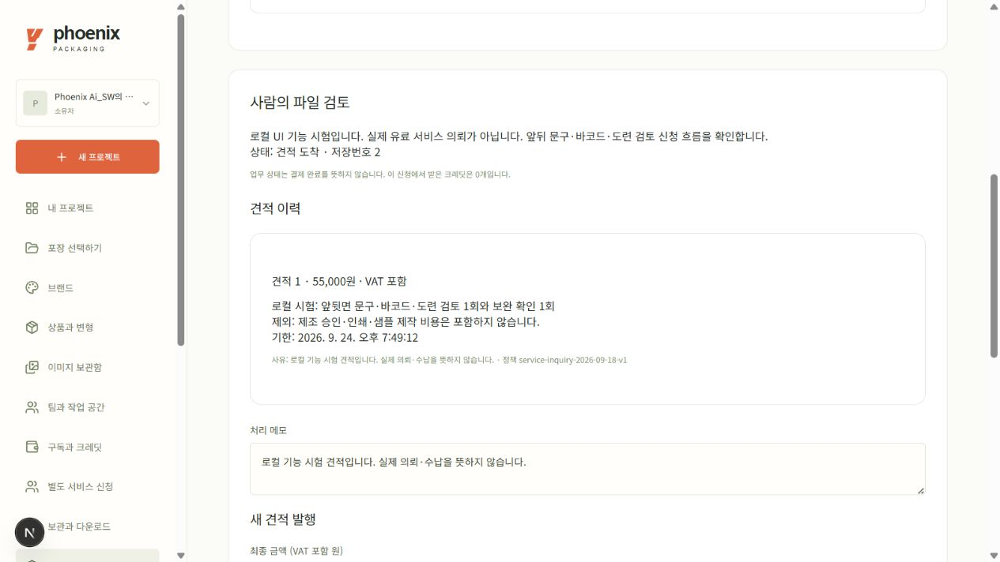
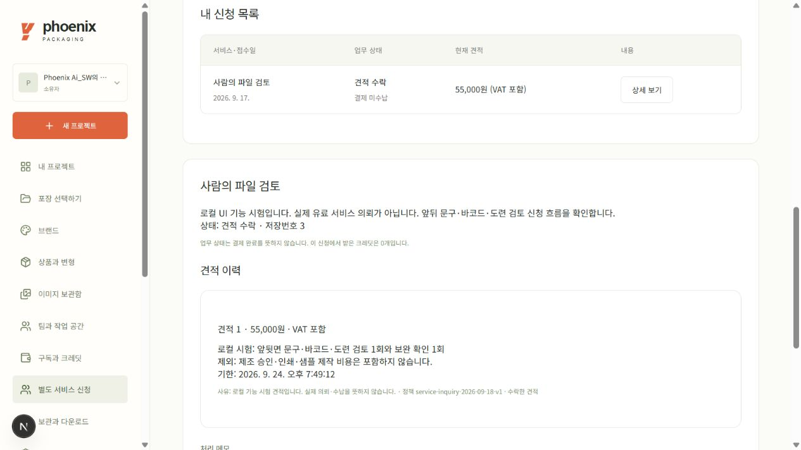
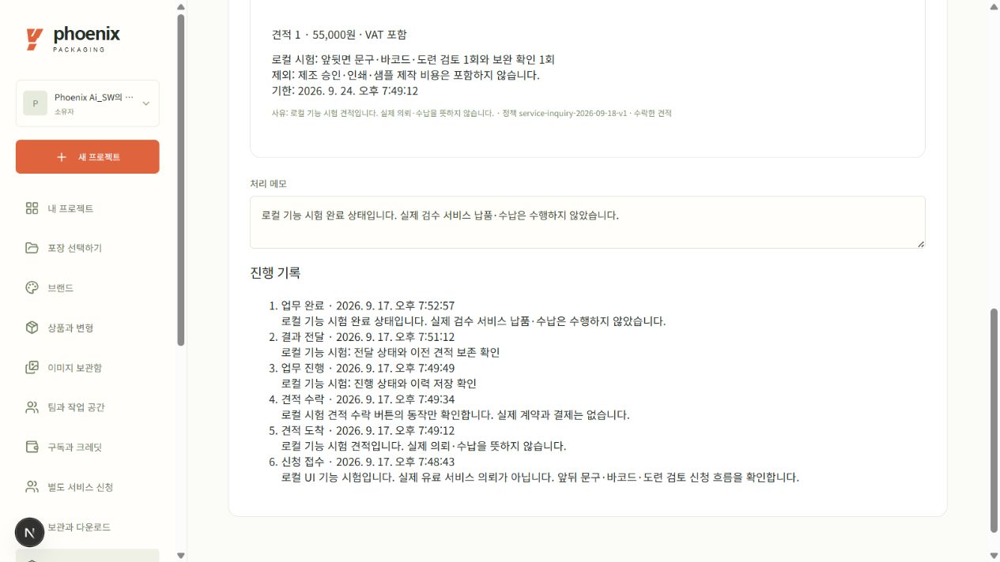

# 별도 서비스 신청·견적·진행 기록

2026-09-18 개발 중. 최초 작업지시서 §12.1의 초기 범위인 신청·견적·상태 관리를 구현한다. 실제 결제, 전문가 자동 배정, 첫 달 Pro 구독 개통을 완료한 것으로 표시하지 않는다.

## 사용 순서

1. 조직 소유자가 **별도 서비스 신청**에서 사람의 파일 검토(55,000원, VAT 포함 제안), 일회 도입 지원(100,000원 제안), 첫 달 Pro 모집 문의(99,000원 제안)를 선택한다. 파일 검토는 본인 조직의 프로젝트를 연결해야 한다.
2. 운영 관리자는 **서비스 신청과 견적 관리**에서 접수 내용을 확인하고 VAT 포함 최종 금액·제공 범위·제외 사항·유효 기간·사유를 기록한다.
3. 소유자가 현재 견적을 확인하고 수락한다. 수락한 견적은 변경할 수 없다. 새 견적을 내면 이전 견적도 이력에 남고, 구 버전이나 만료된 견적의 수락은 차단된다.
4. 파일 검토·도입 지원은 관리자가 진행 중 → 결과 전달 → 업무 완료를 순서대로 기록할 수 있다. 상태와 처리 메모는 접수 기록에 남는다. 결제 완료를 의미하지 않는다.
5. 첫 달 Pro 모집 문의는 실제 구독 이행 기능에 연결하기 전까지 수락 후 구독 개통·업무 완료로 전환할 수 없다.

## 정산과 접근 범위

신청·수락·업무 완료는 결제 주문, 청구, 크레딧 지급을 만들지 않는다. 도입 지원은 일회성이며 자동 갱신하지 않는다. 금액 제안과 실제 최종 견적을 구분하고, 수락 화면에 결제·구독 미실행을 표시한다.

일반 editor/viewer는 신청이나 견적 수락 권한이 없다. 다른 조직의 신청 ID나 프로젝트 ID를 넣어도 접근할 수 없다. 관리자는 고객이 제출한 신청 내용과 견적만 조회하며 이 화면에서 고객 프로젝트·원본 자산 열람 권한을 얻지 않는다.

## 저장과 검증

요청 식별자와 정규화 본문 해시로 중복 접수를 방지한다. 동일 요청 두 건의 동시 실행에서도 신청 한 건을 반환한다. 상태 변경은 현재 revision을 검사하며, 견적 동시 수락은 한 번만 반영한다. 카탈로그·정책 버전·견적·상태 기록을 별도로 보관한다. 변경마다 행위자와 감사 이벤트를 남긴다.

서버 시험 8개 통과: 금액 주입·CSRF·다른 조직·팀원 권한, 동시 재요청과 수락, 수락 후 견적 변경 방지, 만료/취소, 순서 없는 상태 전환, 크레딧·결제 미발생, 목록 페이지 구분. 테스트는 격리 데이터이며 실제 서비스 제공·금액 수납을 뜻하지 않는다. 격리 로컬 `localhost:3001`에서 실제 로그인 세션으로 아래 전 과정을 실행했다. 운영 배포는 아직 하지 않았다.

## 실제 화면으로 실행한 사례

실제 유료 서비스가 아닌 기능 시험임을 신청문에 명시하고, 자체 검토 프로젝트에 55,000원 파일 검토 견적을 작성했다. 소유자가 범위·제외 사항을 확인해 수락한 뒤 관리자가 작업 시작, 결과 전달, 업무 완료를 차례로 기록했다. `0a47f5ed-082c-456d-8b1d-0897333dd7e9`는 revision6·완료 상태이며 신청/견적/수락/진행/전달/완료 6개 사건과 견적1개가 남았다. 해당 격리 DB의 결제 주문0·구독0을 확인했다. 전문 검토 실제 납품이나 금액 수납 실증은 아니다.

사진은 실행 당시 화면이다. 이후 날짜 응답에 UTC 시간대를 명시하고 한국 시간으로 표시하도록 수정했다.
