# 작업지시서 보완: 원본 ZIP·등록 구조·AI 입력 맥락

2026-09-18 작성. 이 문서는 2차 보완의 **실제 로컬 실행과 운영 배포 기록**이다. [PR #8](https://github.com/phoenixai-sw/phoenix-packaging/pull/8), 운영 커밋 `7f4e81f`의 웹·API 배포와 GitHub CI가 통과했다. 전체 작업지시서 완료나 최종 제조본 완성을 뜻하지 않는다.

## 1. 편집용 원본 ZIP 받기

편집기의 **검수와 출력 → 편집용 프로젝트 ZIP · 0크레딧**을 누르면 먼저 현재 장면을 저장한 뒤 해당 저장본을 고정한다. 완료 후 다운로드하거나 파일 이력에서 다시 받을 수 있다. 검토·제작 PDF와 별개이며 제조 승인 없이 받을 수 있다.

실제 QA 프로젝트 `c955247b-b847-421e-9313-7d7fe9ace025`에서 저장본 15를 만들었다. 이미지 2개, 글꼴 2개, 총 12파일·14,337,211바이트였다. ZIP 내부 모든 파일의 SHA-256, 저장본과 scene.json 일치, 저장소 키·제공자 프롬프트 미노출을 확인했다. 고객 크레딧 차감은 0이다. 현재 앱에는 ZIP 재가져오기 화면이 없다.

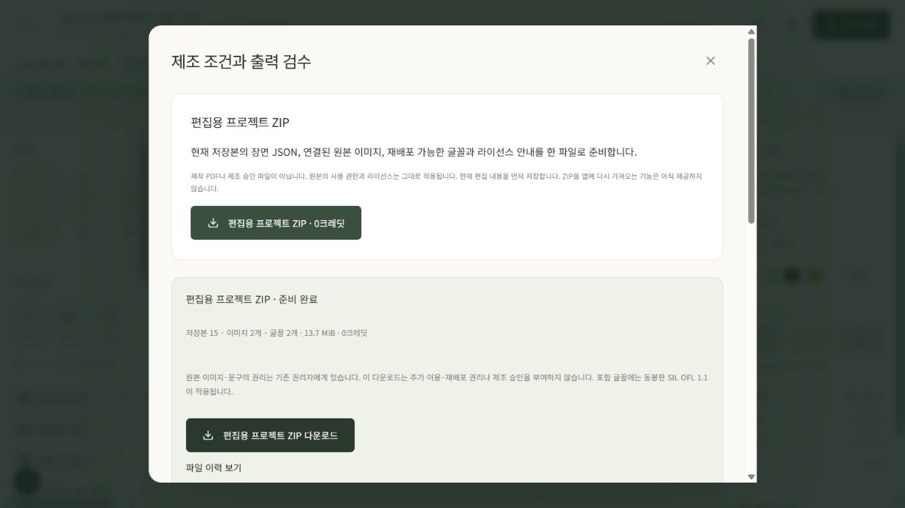

## 2. 구조를 등록하고 기존 디자인과 비교하기

관리자의 **등록 구조 · 검토 공개 → 새 검토 구조 검증·등록**에서 정의를 검사한 뒤 출처·사용권·등록 주체를 기록한다. 이번에는 앱 자체 예시를 이용한 좌8·우12·상6·하14mm 실링을 로컬에 등록했다. 실제 제조사 자료나 승인으로 표시하지 않았다.

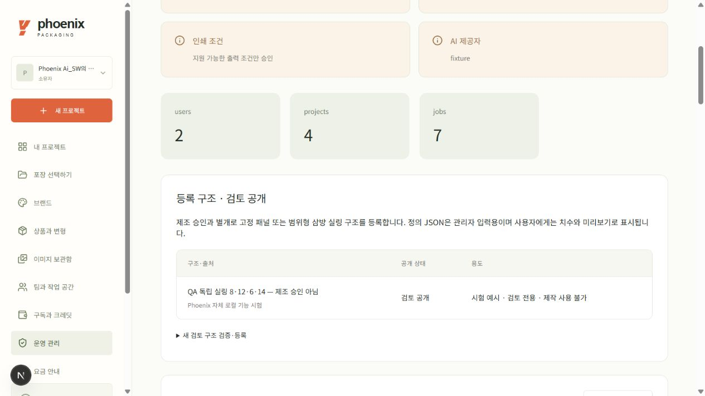

사용자는 **등록 구조 검토**에서 같은 포장 종류의 공개 구조를 선택하고 **저장하고 구조 미리보기**를 누른다. 고정 구조는 등록 치수를 유지하고, 범위형 구조는 허용 폭·높이만 입력할 수 있다. 기존 객체 크기·문구·위치를 자동 변경하지 않는다.

실제 QA 프로젝트 `65f777c9-84d7-4ce1-b5f0-2a32d0cfa7b1`은 230×310mm 삼방 봉투다. 기본 문구의 X16mm·폭198mm가 새 오른쪽 안전선 X213mm를 1mm 넘어서 첫 적용이 차단됐다. **해당 면·객체 확인**으로 이동해 앞면 3개·뒷면 2개 문구 폭을 196mm로 직접 바꿨다. 문구 내용은 유지했다. 다시 미리보기하자 검증을 통과했다.

추가로 폭을 228mm로 줄이는 미리보기를 실행해 같은 안전영역 충돌이 재현되고 적용 버튼이 막히는 것을 확인했다. 이 축소는 실제 프로젝트에 적용하지 않았다. 아래 사진은 이 추가 재현 화면이다.

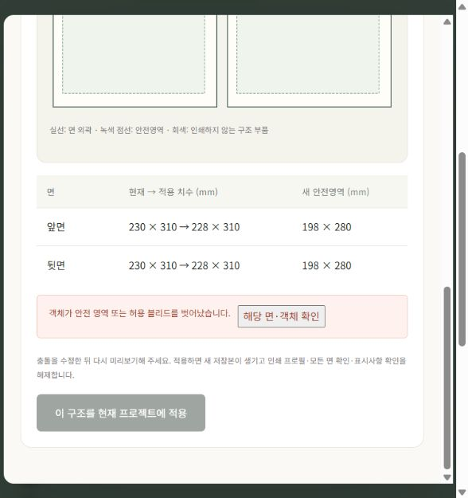

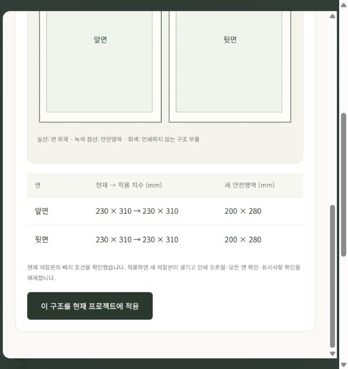

**이 구조를 현재 프로젝트에 적용**하면 새 저장본이 생기고 이전 인쇄 프로필·면 확인·표시사항 확인은 해제된다. 적용 중에는 편집을 잠가 늦은 응답이 새 작업을 덮지 않게 한다. 등록 정의와 해석 도형을 저장본에 고정해 이후 등록 내용 변경이 과거 결과를 바꾸지 않는다.

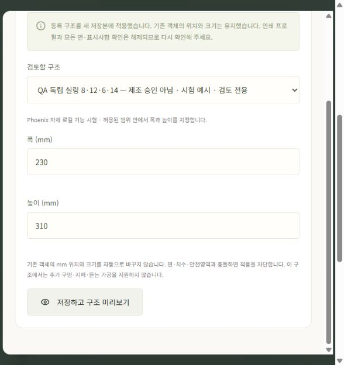

## 3. 바코드·PDF·3D 확인

새 구조 적용 후 **바코드와 가공 → 검토용 샘플 번호 만들기 → 검증하고 추가**를 실행했다. 샘플 EAN-13 `9520000000011`이 X13·Y259.15mm에 자동 배치됐다. 정식 상품 번호가 아니며 제작 출력은 제한된다. 등록 구조 V2는 아직 추가 구멍·지퍼·노치를 지원하지 않아 해당 가공 입력을 숨기고 이유를 안내한다. 기존 데모 가공 기능은 유지한다.

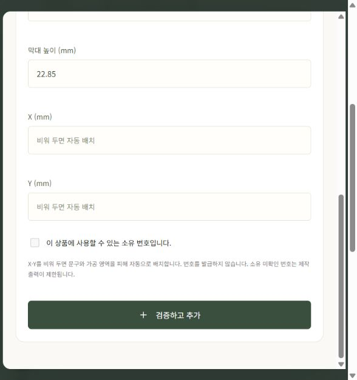

제조 조건에 ‘로컬 검토 시험 - 소재 미확정’을 저장한 뒤 검토 PDF 검수·생성·다운로드를 실행했다. 2페이지 모두 236×316mm이며 230×310mm 재단 크기와 사방 3mm 검토 도련에 해당한다. 한글, 샘플 바코드, 서로 다른 실링 폭과 안전영역을 실제 PDF 렌더로 확인했다. 같은 프로젝트의 ZIP 10파일도 장면·구조 스냅샷과 해시가 일치했다.

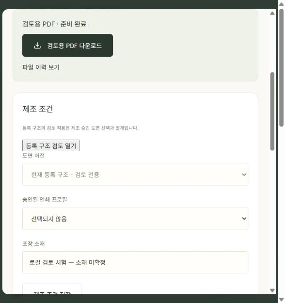

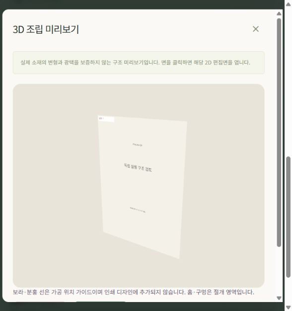

등록 구조 V2는 검토 단계다. 실제 두께·주름·조립 공차 시뮬레이션, 곡선 칼선, 제조용 CMYK/PDF-X/분판 출력까지 완료한 것으로 해석하지 않는다.

## 4. AI 생성 지시와 공급자 예산

AI 견적은 현재 면의 크기·비율, 브랜드 색, 보이는 텍스트/바코드의 위치를 서버에서 계산해 생성 지시에 고정한다. 화면에는 반영된 면·색상·여백 수를 표시한다. 상품 문구 원문이나 번호는 맥락에 넣지 않는다. 실제 색과 여백의 생성 품질은 결과를 보고 확인해야 한다.

QA 프로젝트에서 실제 **견적**을 확인했다. 스탠드 파우치 앞면·문구 자리 1곳이 표시됐고, 이 검증 중 유료 생성 요청은 실행하지 않았다. 브랜드를 연결하지 않은 QA였으므로 색상 항목은 표시되지 않았다.

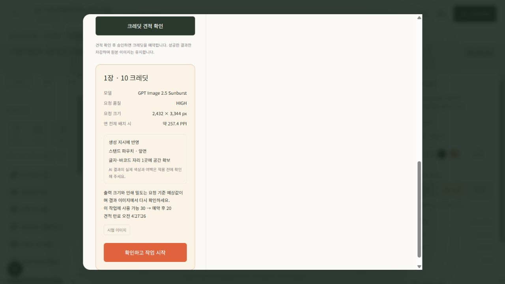

관리자 비용 화면에는 USD 일일 예상 한도, 비용 불명 요청의 가정 비용, 월간 화면 알림이 추가된다. 호출 전 확정 실패는 비용을 풀고, 외부 호출 후 불명 결과는 보수적으로 유지한다. 이 값은 고객 크레딧과 별개이며 공급자 최종 청구액의 정확한 상한을 보장하지 않는다. 월간 알림은 이 화면 안에서만 제공한다.

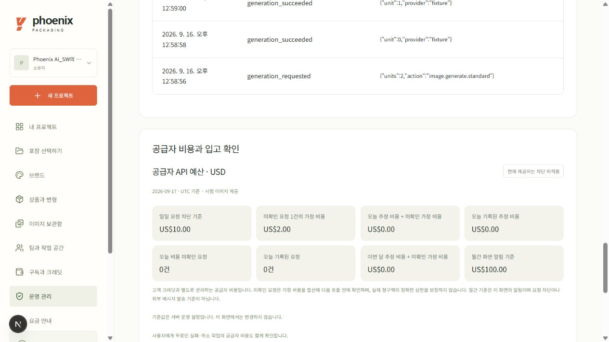

## 운영 사이트에서 확인한 ZIP

운영 QA 프로젝트 `02d610a9-1e3c-46b6-a218-06cf37479b19`의 저장본 6에서 **편집용 프로젝트 ZIP**을 직접 생성하고 다운로드 링크를 실행했다. 기존 디자인과 저장본은 변경하지 않았다. 12파일·10,258,148바이트(화면 9.8MiB)였고, 이미지 2개와 글꼴 2개를 포함했다. 원본 저장본과 `scene.json`, 내부 모든 파일 해시를 확인했다. ZIP SHA-256은 `b22bb5b920506239dfdf8663bab43bf820439792b4442aaf56feb8c6c593767b`다. 크레딧 잔액 0을 유지했고 유료 AI를 호출하지 않았다.

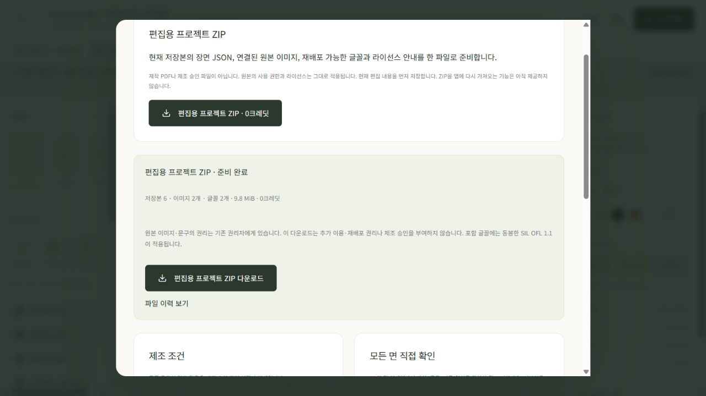

## 검증과 남은 범위

- 프런트 테스트 66개, 타입 검사, 운영 빌드 통과.
- 구조 집중 회귀 40개 및 geometry/품질 180개 통과. 고정 상자 검토 PDF 7페이지도 별도 렌더 확인.
- 비용·AI·맥락 집중 회귀 50개, 서버 전체 회귀 612개 통과. GitHub push·PR CI도 통과했다.
- 원본 ZIP 자체 21개를 포함한 집중 회귀 43개 통과. 다른 조직·팀 권한, 보관 상태, 파일 변조·한도·재시도·늦은 worker도 검사.
- 운영 반영 전 백업에서 41테이블·290행·32객체 복원을 확인했다. 운영 DB를 `0008`에서 `0010_structure_snapshots`로 이전했고 기존 프로젝트 13·저장본 54·자산 17건 보존과 RLS를 확인했다. 별도 복원 환경의 앱 재열기도 통과했다. PostgreSQL 물리 복원/PITR 시험으로 부르지 않는다.

전체 잔여 항목은 [원문 요구사항 추적표](spec-completion-tracker.ko.md)를 따른다. 실제 PG 결제, 제조 승인·제출 10건, 전체 API 계약, 폰트 관리, 서비스 주문·지원/보관 업무는 이 릴리스의 완료 범위가 아니다.
