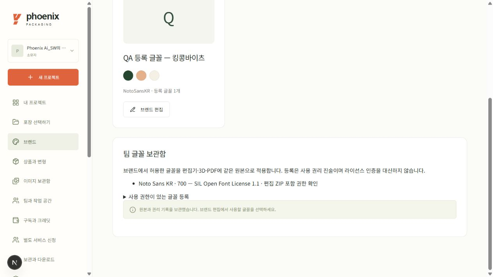
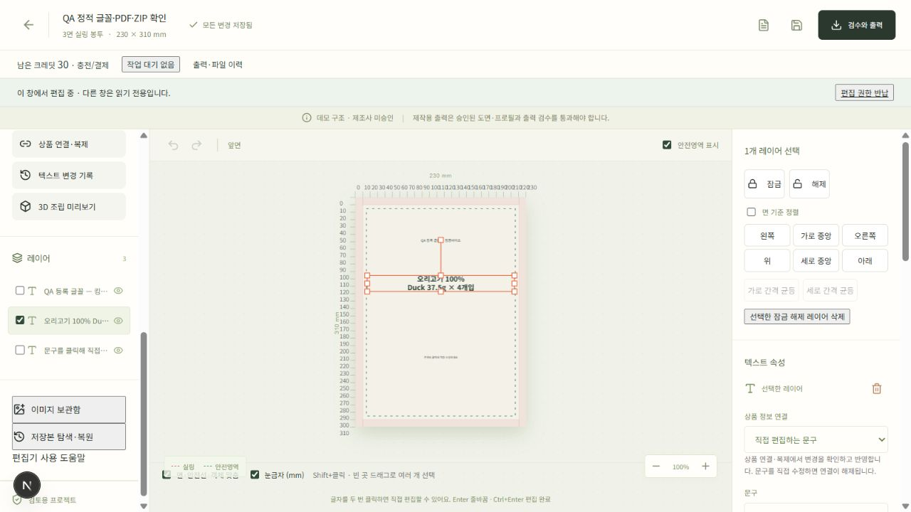
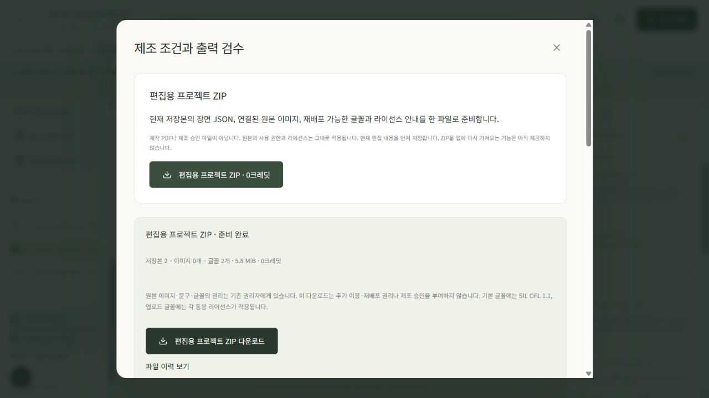
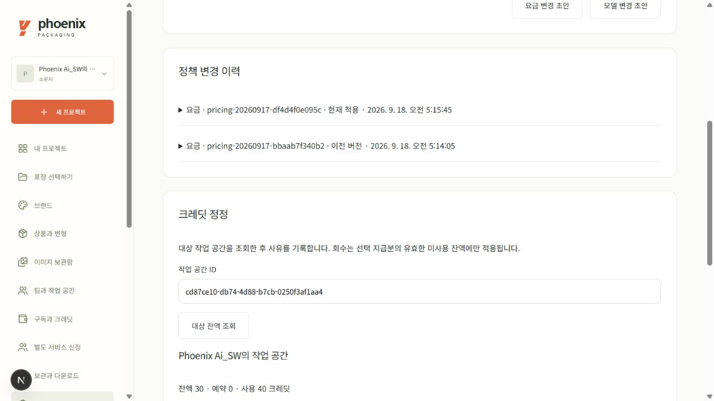
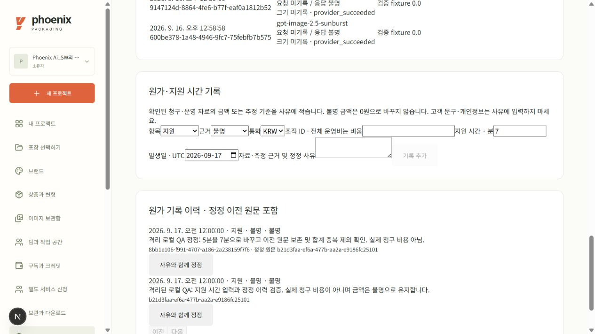
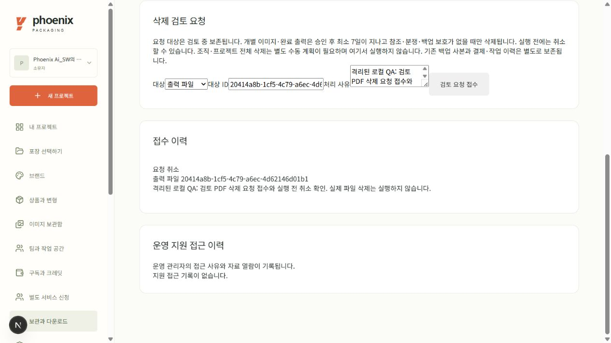
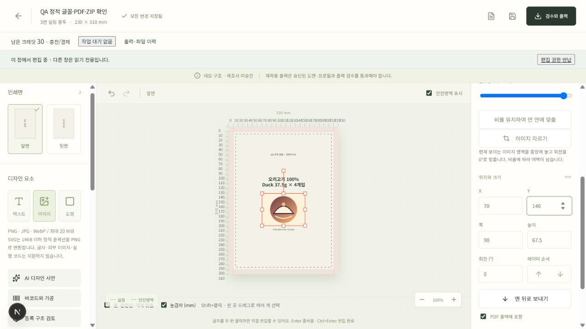
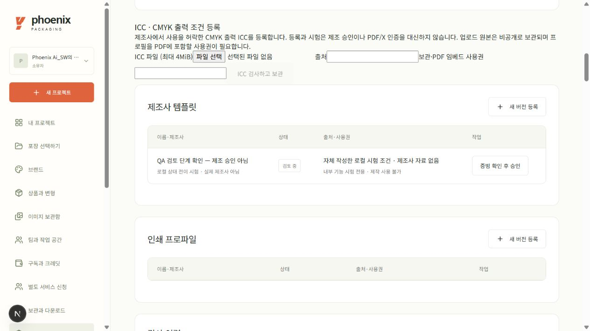

# 운영 도구·브랜드 글꼴·출력 보완 — 로컬 사용·검증 기록

2026-09-18, `codex/spec-completion-ops` 배포 후보. 아래는 **격리된 localhost:3001에서 실제 메뉴로 수행한 작업**과 별도 자동시험을 구분한 기록이다. 운영 배포, 실제 유료 결제, 제조사 승인 또는 원문 전체 완료를 뜻하지 않는다. 운영 가격·크레딧 변경과 추가 유료 AI 호출은 없었다.

현재 시험 프로젝트는 `c19bb51b-e06e-47cc-9623-2f8ba32c1428`의 **등록 글꼴 기능 QA 사본**이다. 이전 킹콩바이츠 V2 최종 디자인을 수정하거나 제조용 최종본으로 대체한 것이 아니다. 뒷면의 초기 안내 문구도 그대로 두었다.

## 1. 브랜드 글꼴 등록 → 편집 → 저장 → 다시 열기

1. **브랜드 보관함 → 팀 글꼴 보관함**에서 정적 TTF와 출처·권리자·라이선스, 웹/편집/인쇄 사용 권한을 등록한다. 편집 ZIP에 원본 글꼴을 넣는 권한은 별도로 확인한다.
2. **브랜드 편집 → 새 문구에 허용할 등록 글꼴**에서 파일을 선택해 저장한다. 해당 브랜드로 프로젝트를 만들거나 기존 프로젝트에 브랜드를 연결한다.
3. 편집기에서 문구 레이어를 선택하고 **속성 → 글꼴**에서 등록 글꼴을 고른다. 저장 후 다시 열어 같은 글꼴과 문구가 유지되는지 확인한다. 목록을 읽는 동안에는 ‘등록 글꼴 확인 중…’을 표시하며 저장된 글꼴을 기본 글꼴로 바꾸지 않는다.

실제 UI에서 Noto Sans KR Bold를 등록하고 새 브랜드에 허용한 뒤, 앞면의 **오리고기 100% / Duck 37.5g × 4개입**을 등록 글꼴 700·27pt로 저장했다. 다시 연 장면과 3D에서 문구를 확인했다. 파일의 실제 두께를 사용하며 임의 합성 굵기를 쓰지 않는다.

등록한 파일·권리 기록은 불변이다. 브랜드 허용 목록에서 빼도 기존 저장본과 과거 이력의 글꼴은 보존된다. 정적 TTF만 지원하며 가변·CFF·컬러 글꼴, 누락 글리프와 복잡한 셰이핑은 명확히 차단한다. 권리 기록은 사용자의 확인이며 플랫폼의 법적 이용권 인증이 아니다. [지원 범위와 절차](brand-fonts.ko.md)

## 2. 같은 저장본에서 PDF·편집 ZIP·CMYK 시험 출력

**검수와 출력**에서 무료 검토 PDF 또는 **편집용 프로젝트 ZIP**을 만들고, **CMYK 출력 시험**에서 무료 시험 ZIP을 요청한다. 파일 이력에서 완료 상태와 종류를 확인해 다운로드한다. 편집 ZIP은 장면·원본 이미지·허용된 글꼴·라이선스의 보관 파일이고, CMYK 시험 ZIP은 제조 승인본이 아니다.

같은 저장본 **2번**으로 실제 UI에서 요청한 세 작업이 모두 성공했다.

| 파일 | 실제 확인 결과 |
| --- | --- |
| 검토 PDF `20414a8b…` | 2페이지·30,846B. 한글/영문/중량 추출과 등록 글꼴 부분 포함 확인 |
| 편집 ZIP `c2c93400…` | 11파일·6,130,948B. 저장 장면 일치, 재배포가 허용된 TTF 원본·라이선스와 전체 manifest 해시 확인 |
| CMYK 시험 ZIP `e2f549f8…` | 6파일·292,652B. 동일 글꼴의 실제 윤곽선, CMYK ICC, 분리 아트/CUT/FOLD와 전체 manifest 해시 확인 |

등록 글꼴 SHA는 세 작업에서 동일했다. 검토 PDF 2페이지와 CMYK 아트·CUT·FOLD 각 2페이지, **총 8페이지를 렌더해 전수 시각 확인**했다. TrimBox는 모두 230×310mm이며 3mm 도련과 시험 표기가 유지된다. 세 작업은 모두 **0크레딧·검토 전용**이다.

현재 CMYK 시험은 합성 ICC와 데모 구조를 쓴 기능 검증이다. 실제 제조사 색상 교정·바코드 실물 등급·입고 승인을 수행하지 않았다. PDF/X·별색·화이트·오버프린트·곡선 및 구멍/지퍼/노치의 제작 출력은 미지원 조건으로 차단한다. [실제 파일 ID·박스·해시 검수](print-engine-icc-outline.ko.md#격리-로컬-ui의-실제-출력-확인)

원본 PDF/ZIP과 전수 검수 기록 `output/ops-ui/local-ui-export-verification.json`은 작업 PC에 보관하며 Git에 대형 출력 파일을 넣지 않는다.

## 3. 관리자 요금 정책과 크레딧 정정

**운영 관리 → 요금·모델 정책**에서 현재 정책으로 초안을 만들고 변경 사유와 비교를 확인한 뒤 게시한다. 공개 요금 화면은 게시 정책을 읽지만, 기존 주문·유효 구독의 동의 요금은 당시 스냅샷을 유지한다. 이전 값으로 돌아갈 때도 새 버전을 게시해 이력을 남긴다.

격리 UI에서 Starter 공급가 49,000→51,000원, 표준 작업 10→11크레딧을 게시했다. 공개 화면의 VAT 포함 **53,900→56,100원·11크레딧** 반영을 확인한 뒤 원래 가격과 단가로 복원했다.

크레딧 정정은 대상 작업 공간, 수량, 범위, 기한과 사유를 기록한다. 회수는 지정 지급분의 남은 사용 가능 수량 안에서만 수행한다. 로컬 QA 공간에 표준 전용 **3크레딧 지급 → 같은 지급분 3회수**를 실행해 잔액30으로 복원했고, 두 원장 기록과 사유는 보존됐다.

이 메뉴는 실제 결제 게이트를 열거나 고객에게 유료 구독 자격을 부여하지 않는다. 운영 가격·크레딧은 변경하지 않았다. [정책·정정 검증 상세](admin-policies.ko.md)

## 4. 별도 서비스 신청과 견적

소유자는 **별도 서비스 신청**에서 검토/도입 지원/첫 달 Pro 모집 문의를 접수한다. 관리자는 **서비스 신청과 견적 관리**에서 범위·제외 사항·VAT 포함 금액·기한을 제안한다. 소유자가 수락한 뒤 관리자가 진행·전달·완료를 순서대로 기록한다.

로컬 자체 프로젝트의 55,000원 파일 검토 시험에서 **신청 → 견적 → 수락 → 진행 → 결과 전달 → 업무 완료** 6단계를 실제 화면으로 수행했다. 신청 `0a47f5ed…`의 저장본6과 사건6개·견적1개가 남았고, 해당 DB의 결제 주문·구독은 각각0이었다.

이는 견적·업무 상태 관리의 실동작 확인이다. 실제 금액 수납, 전문 검토 서비스 납품, Pro 특별 구독 개통을 수행하지 않았다. 첫 달 Pro 문의를 실제 구독으로 개통하는 단계는 아직 연결하지 않았다. [서비스 메뉴 상세](service-orders.ko.md)

## 5. 내부 성과·원가와 비용 정정

**운영 관리 → 내부 성과·원가**에서 조회 기간을 정한다. 실제 제공자/fixture와 제조사 회신/test를 구분하고, 실제·추정·미확인 비용도 분리해서 본다. 활동 시간은 사람의 정확한 노동시간이나 청구 시간이 아닌 브라우저 신호에 따른 추정이다.

실제 로컬 UI에서 프로젝트 생성1·필수 항목 완료1·문구 수정1, 활동 추정2.0분과 fixture 요청4건의 분리 표시를 확인했다. 이어 지원 비용을 **금액 미확인·5분**으로 기록하고, 같은 항목을 사유와 함께 **7분**으로 정정했다. 두 원본 ID/기록은 남고 유효 합계는12분이 아닌 **7분**, 비용은0원이 아닌 **미확인(null)**으로 유지됐다.

입력 키·문구·포인터 좌표를 계측 데이터로 보내거나 외부 분석 서비스를 호출하지 않는다. 실제 유료 고객 획득·제조사10건·원가 청구서 대사는 미실시다. [지표 정의와 제한](metrics-operations.ko.md)

## 6. 보관·삭제 요청과 취소

소유자는 **보관·삭제 관리**에서 해당 파일과 요청 사유를 확인해 삭제를 요청한다. 요청/승인/유예/보존 hold와 실제 삭제는 서로 다른 상태다. 아직 실행되지 않은 요청은 취소할 수 있으며, 분쟁·지원·백업 보존이나 사용 중 참조가 있으면 서버가 삭제를 막는다.

로컬 검토 PDF `20414a8b…`에 삭제를 요청하고 **보존 hold 안내 → 요청 취소**를 실제 화면에서 확인했다. 이 점검의 실제 파일 삭제는0건이며, 운영 삭제/GC 스위치를 켜거나 운영 파일을 삭제하지 않았다.

조직/프로젝트 전체 삭제와 정체를 알 수 없는 파일의 자동 GC는 지원하지 않는다. [보관·지원 범위](retention-operations.ko.md)

## 7. 정적 SVG 가져오기

**편집기 → 이미지** 또는 **브랜드 → 로고 이미지**에서 정적 `.svg`를 선택한다. 허용 도형을 정화해 PNG로 변환하므로 편집기·3D·PDF가 같은 결과를 사용한다. 편집 가능한 SVG 도형으로 분해하지 않는다. SVG 속 글자는 원래 글꼴로 윤곽선을 만든 뒤 올리고, 플랫폼에서 수정할 문구는 별도 텍스트로 추가한다.

실제 로컬 UI에서 자체 시험 SVG를 업로드해 **1200×900px → 90×67.5mm, X70/Y140mm**로 비율을 유지해 배치·저장했다. 저장본4의 무료 편집 ZIP `0e658b5f…`은6,227,853B이며, 이미지2개(정화 SVG 원본과 표시 PNG)·글꼴2개와 장면·manifest의 SHA 일치를 확인했다.

같은 저장본의 검토 PDF `febdd1dd…`도75,164B·2페이지로 완료됐다. 두 페이지를 모두 렌더해 Trim230×310mm·Media236×316mm, SVG의 표시 PNG1200×900px·실효338.67PPI, 등록 글꼴700·27pt 한글을 확인했다. 이 출력도 검토 전용이며 제작 승인본이 아니다.

스크립트·외부 참조·내장 이미지·애니메이션·필터·SVG 글자는 허용하지 않는다. 정화 원본은 권한이 있는 편집 ZIP의 원본 계보로 보관하며 캔버스에는 표시 PNG만 배치한다. SVG 집중48개, 기존 업로드/편집 ZIP 포함80개 회귀가 각각 통과했다. 실제 운영 Linux 업로드는 배포 후 확인할 항목이다. [지원 요소·한도·정화 규칙](svg-import.ko.md)

## 8. 제조 조건의 검토 단계

**운영 관리 → 제조 도면/인쇄 프로필**에서 자료를 초안으로 등록하고, 사유를 적어 **검토 요청**을 보낸다. ‘검토중’은 ‘승인됨’과 다르다. 제조 승인에는 별도 증빙·담당자·확인 기록과 서버 검증이 필요하다.

실제 로컬 UI에서 ‘QA 검토 단계 확인 — 제조 승인 아님’ 초안을 만들고 사유를 입력해 **검토중**으로 전환했다. 승인 창을 열어 증빙·담당자·확인 기록이 없으면 승인 버튼이 비활성인 것을 확인한 뒤 닫았다. **승인 실행은0회**이며 시험 자료를 제조사 승인 자료로 만들지 않았다.

완료된 제작 파일의 이력에는 출력 당시 조건의 현재 승인 상태와 고객 공개용 철회 사유를 따로 표시한다. 과거 파일은 보존하고 내부 감사 사유는 공개하지 않는다. 이 철회 경로는 격리 API/프런트 회귀로 확인했으며 실제 운영 제작 파일을 철회한 것은 아니다.

## 검증 범위와 남은 확인

최종 소스 기준 전체 프런트 **78개**, 타입 검사, Scene/OpenAPI/TS 계약 drift가 통과했다. 과거 manifest·승인 철회 계약10개도 통과했다. 글꼴 API15개, 글꼴 포함 geometry216개, 지표25개와 관련 인증/결제/AI27개는 각 영역의 시험이며 겹치는 수를 합쳐 전체 서버 인수 결과로 쓰지 않는다. 새 후보의 공개 HTTP 계약은141개(JSON135·파일6)다. PR9 초기 후보`9907248`의 웹/API 프리뷰 빌드는 성공했으며, 전체 서버 회귀·최종 CI·운영 배포는 별도로 확정할 항목이다.

과거 출력의 계약 검증에서도 실제 복구본25개 작업을 읽기 전용으로 대조했다. 초기 manifest에 없던 검수·가공 필드를 응답에 새로 채우지 않고 보존하며, 해당 과거 두 단계의 HTTP 조회·파일 바이트 불변 회귀를 추가했다. 이는 새 파일을 다시 생성하거나 기존 고객 DB/파일을 고쳐 통과시킨 검증이 아니다.

최신 운영 논리 백업은 **41테이블·293행·33객체**다. 네트워크를 차단한 격리 복원 앱에서 기존 소유자의 프로젝트7·저장본41·자산13·작업16·출력9·원장16과 장면 이미지 연결14개를 재열어 확인했다. Google 실로그인을 흉내 낸 운영 우회가 아니라 격리 앱 전용 시험 세션이며, 로컬 세션/만료 갱신 외 원본 운영 DB·파일은 변경하지 않았다. PostgreSQL 물리 복구/PITR 검증과는 별개다.

최종 전체 회귀·CI·운영 배포는 결과를 받은 뒤 각각 갱신한다. 현재 기록만으로 운영 제공이나 원문 전체 완성을 선언하지 않는다. [전체 추적표](spec-completion-tracker.ko.md), [운영 전 조건](production-readiness.md)
